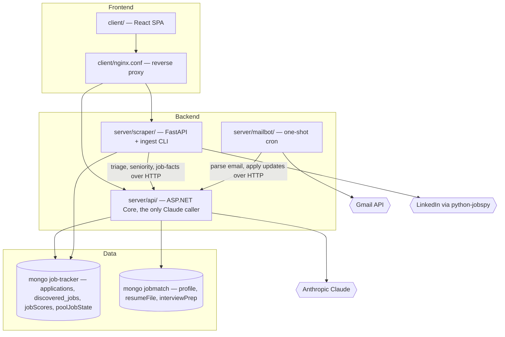

# TL;DR

NextRole runs a job hunt end to end. Judging whether a role actually fits you means reading the posting closely, looking up the company, and cross-checking it against your CV, strengths, values, and dealbreakers — work nobody does six hundred times. NextRole does it for you: it discovers listings daily into one shared pool, scores the plausible ones against your own professional profile the moment you open Matches, tailors a résumé per application, watches your inbox for replies, and tracks every role from first application to final outcome.

There are two kinds of user, and they are the same person at different moments. A **candidate** uploads a CV, scans overnight matches, adds what looks good to a board, generates a tailored résumé pack, and rehearses interviews against their own prepared answers. An **operator** — whoever hosts the instance — edits the role list the daily ingest searches, watches cost, and decides whether the deployment serves one configured person (`Identity:Mode=Fixed`) or anyone with a cookie (`Cookie`, which is what `nextrole.cloud` runs). A typical candidate morning is five minutes: open Matches, scan what came in overnight, add what looks good, glance at replies; the board is already current because the mailbot updated it from Gmail overnight.

The product's organizing idea is a line between what is true of a *posting* and what is true of *you*. What a posting says is read once, for everybody, and shared. What it is worth is yours alone, computed on demand, and stored under your id. That split is what makes a shared job pool affordable and a per-user score honest.

**Non-goals:** authentication, accounts, or password recovery (a `uid` cookie is the whole identity, deliberately — see [`docs/multi-user.md`](docs/multi-user.md)); applying to jobs on the user's behalf; a job board or employer-side product; file storage beyond the one uploaded CV; analytics or reporting beyond the tracker's own stats.

## Capabilities

- **Shared job pool & daily ingest** — `server/scraper`
  A cron-driven run scrapes LinkedIn for a role list held in [`server/scraper/config/roles.json`](server/scraper/config/roles.json) — configuration, never anyone's saved search — deduplicates on a stable `pool_key` (the job URL, else `sha256(company + title + date)`), classifies seniority, and has Claude read each *new* posting's stated requirements exactly once: required years, must-have and nice-to-have tech, seniority band, domain, location. A listing absent from N consecutive runs is marked inactive and never deleted. The pool document holds only what is true for every user. The role list is the config baseline plus roles grown from users' CVs (`pool_roles`), capped by `max_roles`. ([`server/scraper/IMPLEMENTATION.md`](server/scraper/IMPLEMENTATION.md) · [`docs/job-pool.md`](docs/job-pool.md))

- **Per-user scoring, on demand** — `server/api`
  Nothing is scored at ingest. Opening Matches calls `POST /api/match/pool-scan`, which narrows the shared pool with a cheap Mongo filter over the extracted facts (location, seniority, tech overlap), caps the result at 50, and runs the Analyst→Evaluator pair only over jobs this user has never had scored. The output is a full breakdown (technical / execution / sustainability fit) and a verdict from `STRONG_YES` to `STRONG_NO` — a judgement, not a similarity ranking. Results land in `jobScores` keyed by user, so a second visit pays only for what is new. Every technology the Evaluator names as the candidate's is checked server-side against the profile (`ClaimGrounding`), and the missing-requirement count that caps the technical score is computed from the posting's facts rather than from the model's own account of itself. ([`server/api/IMPLEMENTATION.md`](server/api/IMPLEMENTATION.md) · [`docs/scoring-and-search.md`](docs/scoring-and-search.md))

- **Application tracker** — `server/api` + `client`
  The Active board moves a role through Added → Ready → Applied → Interviewing, with closed applications and the full detail view (notes, interviews, salary, timeline, AI analysis) on `/tracker`. Applications are unique per user on `(UserId, Company, JobTitle)` case-insensitively, enforced by a unique index rather than a check-then-act read. The board is also the mailbot's input: it knows which companies to watch in Gmail because they are on it. ([`docs/tracker.md`](docs/tracker.md))

- **Generate Pack (AI-tailored résumé)** — `server/api`
  One click per application produces a résumé PDF that reorders and re-emphasizes the candidate's real profile toward that posting, rendered on demand with QuestPDF and never stored as a file. `ResumePackValidator` blocks a pack whose text claims anything the profile does not evidence — packs go to employers, so this one refuses rather than annotates. Capped at 3 per user per day, claimed atomically before the Claude call. ([`docs/resume-pack.md`](docs/resume-pack.md))

- **Interview prep, cues & mock interview** — `server/api` + `client`
  An authoring surface for self-presentations and a Q&A rubric, AI-distilled keyword cues drawn from the candidate's own prepared answers, a conversational mock interview with a debrief, and Interview Insights synthesized from post-interview retros. ([`docs/interview-prep.md`](docs/interview-prep.md))

- **Email sync** — `server/mailbot`
  A one-shot cron process, not a service: it pulls the tracked companies from the API, fetches the matching window of Gmail, has the API parse each message with Claude, and applies status and interview updates — matched by company + title, idempotent, and never moving an application backwards. Already-parsed messages are skipped so the overlapping lookback window costs nothing. ([`server/mailbot/IMPLEMENTATION.md`](server/mailbot/IMPLEMENTATION.md) · [`docs/mailbot.md`](docs/mailbot.md))

- **Profile ingestion** — `server/api` + `client`
  A PDF CV goes to Claude natively (no extraction library) and comes back as a `StructuredProfile`, which is rendered to the `content` string every prompt consumes. The profile is the only user-editable input to scoring; prompts and `scoring_config` are read-only server configuration. ([`docs/scoring-and-search.md`](docs/scoring-and-search.md))

- **Identity & deployment modes** — `server/api/src/Api/Identity`
  `Identity:Mode` is `Fixed` (one configured user) or `Cookie` (multi-user, id from the `uid` cookie the API issues on a visitor's first request). Everything downstream takes a plain `Guid`. The private and public instances are one image and one codebase differing only by environment file. ([`docs/multi-user.md`](docs/multi-user.md))

- **Demo mode** — `server/api/src/Seeder` + allowlist middleware
  `DemoMode=true` serves seeded fictional data with live AI reads and every write 403'd through an explicit allowlist, so a public instance can be explored but not changed. ([`docs/demo-mode.md`](docs/demo-mode.md) · [`docs/hosting-a-public-demo.md`](docs/hosting-a-public-demo.md))

## Tech stack & versions

- **Runtimes:** .NET 10, Python 3.12, Node/Bun (client tooling; **Bun**, not npm/yarn)
- **Frameworks:** ASP.NET Core Minimal APIs, React 19 + React Router 7 + TanStack Query 5, Vite 6, Tailwind v4 + shadcn/ui, FastAPI 0.115 + Pydantic Settings, QuestPDF (résumé rendering)
- **Data:** MongoDB Atlas — two databases, `job-tracker` (tracking + shared pool) and `jobmatch` (profile/scoring)
- **AI:** Claude (Anthropic) — Haiku 4.5 for Analyst/Evaluator/triage/facts, Sonnet 5 for narrative enrichment and résumé packs. **Every Claude call lives in the API**; the scraper and mailbot delegate over HTTP.
- **Scraping:** `python-jobspy` against LinkedIn
- **Messaging bus:** none — services talk over plain HTTP
- **Infra:** Docker Compose on a single Hetzner VPS, images from `ghcr.io`, Caddy in front, Loki/Promtail/Grafana for logs, systemd timers for cron

## Repo topology & boundaries

Each component carries an `IMPLEMENTATION.md` at its own root path.

| Component / Domain | Path globs | Doc |
|---|---|---|
| Web client (SPA) | `client/**` | [`client/IMPLEMENTATION.md`](client/IMPLEMENTATION.md) |
| API (Api + Core + Infrastructure) | `server/api/src/Api/**`, `server/api/src/Core/**`, `server/api/src/Infrastructure/**`, `server/api/tests/**` | [`server/api/IMPLEMENTATION.md`](server/api/IMPLEMENTATION.md) |
| Scraper / ingest | `server/scraper/**` | [`server/scraper/IMPLEMENTATION.md`](server/scraper/IMPLEMENTATION.md) |
| Mailbot (Gmail cron) | `server/mailbot/**` | [`server/mailbot/IMPLEMENTATION.md`](server/mailbot/IMPLEMENTATION.md) |
| Demo seeder (CLI) | `server/api/src/Seeder/**` | [`server/api/src/Seeder/IMPLEMENTATION.md`](server/api/src/Seeder/IMPLEMENTATION.md) |
| DbCopy (CLI) | `server/api/src/DbCopy/**` | [`server/api/src/DbCopy/IMPLEMENTATION.md`](server/api/src/DbCopy/IMPLEMENTATION.md) |
| End-to-end tests | `e2e/**` | [`e2e/IMPLEMENTATION.md`](e2e/IMPLEMENTATION.md) |
| Deployment & ops | `deploy/**`, `docker-compose.yml`, `.github/workflows/**` | [`deploy/README.md`](deploy/README.md) |
| Feature documentation | `docs/**` | — |
| Conventions for agents | `AGENTS.md`, `CLAUDE.md` | — |

**Boundaries that are enforced, not merely agreed:**

- The scraper never scores and never reads a profile. It delegates AI to the API over HTTP.
- Every user-scoped repository takes a `UserScopedCollection<T>`, which has no overload that omits the userId — guarded by `server/api/tests/ArchitectureTests`.
- Every scraper→API call passes `user_id` explicitly (or an explicit `None`) — guarded by an AST walk in `server/scraper/tests/test_identity_forwarding.py`.

## Interfaces

- **HTTP (API):** OpenAPI is generated at runtime, not checked in — `GET /openapi/v1.json` plus a Scalar UI in Development ([`server/api/src/Api/Program.cs`](server/api/src/Api/Program.cs)). Routes live in [`server/api/src/Api/Endpoints`](server/api/src/Api/Endpoints).
- **HTTP (Scraper):** FastAPI's generated `GET /openapi.json`; routes in [`server/scraper/app/main.py`](server/scraper/app/main.py), all under `/api/discovery/**`.
- **GraphQL / gRPC / AsyncAPI:** None.
- **Events / topics:** None — there is no message bus. Cross-service effects are synchronous HTTP calls.
- **Scheduled jobs:** [`deploy/systemd/nextrole-pool-ingest.timer`](deploy/systemd/nextrole-pool-ingest.timer) (05:30 UTC daily → `docker compose --profile cron run --rm pool-ingest`) and [`nextrole-mailbot.timer`](deploy/systemd/nextrole-mailbot.timer) (02:00 UTC daily). Container-internal fallback: [`server/mailbot/crontab`](server/mailbot/crontab).
- **CLI:** `python -m app.cli {run,run-pool,run-all,seed-demo-jobs,eval-verdict,eval-subscore}` ([`server/scraper/app/cli.py`](server/scraper/app/cli.py)); `dotnet run --project server/api/src/Seeder`; `dotnet run --project server/api/src/DbCopy -- <src>=<dst>`.
- **Reverse-proxy route map:** [`client/nginx.conf`](client/nginx.conf) — an explicit path allowlist splitting `/api/**` to the API and `/api/discovery/**` to the scraper.

## Architecture



## Data model (high level)

Database `job-tracker` unless noted.

- **`applications`** — one tracked role per user. Unique on `(UserId, Company, JobTitle)` with a case-insensitive collation. Carries status, salary, the cached match analysis, and its translation.
- **`discovered_jobs`** — the **shared** job pool. Identified by `pool_key` (unique), holding scraped fields plus once-extracted job facts and a seniority band. No per-user field ever lives here. The 60-day retention TTL applies to criteria-driven rows only (`ttl_managed: true`); pool rows are exempt and are marked inactive instead of deleted.
- **`jobScores`** — one user's score for one pool job. The *absence* of a row is what "not yet scored" means.
- **`poolJobState`** — one user's `dismissed` / `saved_to_tracker` flags for one pool job, `_id = "<userId>:<jobId>"`. Kept separate from `jobScores` because the scoring path upserts whole documents and would overwrite it.
- **`pool_roles`** — the shared role list grown from users' CVs, on top of the `roles.json` baseline.
- **`interviews`, `notes`, `statusUpdates`, `resumePacks`** — per-user children of an application, indexed `(UserId, ApplicationId)`.
- **`messages`** — Gmail messages the mailbot tracked. Unique on `(UserId, GmailMessageId)`.
- **`matchSnapshots`** — content-addressed Claude call snapshots, 90-day TTL.
- **`mockInterviewSessions`**, **`userQuotas`**, **`interviewInsights`** — mock-interview transcripts, per-user daily allowances (packs), and synthesized retro insights. The last two are keyed `_id = userId`.
- **`jobmatch` DB** — `profile` (the `StructuredProfile` plus its rendered `content`), `resumeFile` (the uploaded CV), `interviewPrep`. All `_id = userId`.

Shapes live in [`server/api/src/Core/Models`](server/api/src/Core/Models) and [`server/scraper/app/models`](server/scraper/app/models); index definitions in [`ApplicationIndexInitializer.cs`](server/api/src/Infrastructure/Repositories/ApplicationIndexInitializer.cs) and [`server/scraper/app/indexes.py`](server/scraper/app/indexes.py).

## Runtime & operations

- **Environments:** local (`docker compose up`, or three dev processes), plus one VPS running `nextrole.cloud` (`Identity:Mode=Cookie`) as the `api`/`scraper`/`web` services. A second stack on the same box, `private.nextrole.cloud` (Basic Auth, `Identity:Mode=Fixed`), ran the same images off a different env file until sign-in replaced the reason for it; it was retired on 2026-09-16 and `Fixed` mode now has no hosted instance, though the eval CLIs still require it locally. See [`deploy/compose.yml`](deploy/compose.yml).
- **Deployment cadence:** on push to `main`, per service, path-triggered. Each workflow builds its Dockerfile, pushes `:latest` to GHCR, then SSHes to the VPS for `docker compose pull` + `up -d --force-recreate` on that service only. See [`.github/workflows`](.github/workflows).
- **Logs / dashboards:** Loki + Promtail + Grafana, all in [`deploy/compose.yml`](deploy/compose.yml); config in [`deploy/monitoring`](deploy/monitoring).
- **Health & alerting:** `GET /health` (API, ungated even when the ApiKey gate is on), `GET /health` and `GET /api/discovery/health` (scraper). [`deploy/monitoring/check-services.sh`](deploy/monitoring/check-services.sh) polls the expected container set (`caddy api client scraper demo-api demo-client demo-scraper`) and notifies on a state change; [`daily-digest.sh`](deploy/monitoring/daily-digest.sh) sends the daily summary. There are no named SLOs or alert rules — this is a personal-scale deployment.
- **Startup contracts:** the API's user-scope migration is **fatal** on failure (it must not serve a view of the database that does not match it); index creation is best-effort but logs loudly; the scraper's pool-exempt TTL rebuild is fatal, because the alternative is a TTL quietly deleting shared pool rows.
- **Traces:** None.

## Security & compliance

- **AuthN:** none, deliberately. A visitor is a `uid` cookie (HttpOnly, Secure, SameSite=Lax, one year) issued only by the API. No login, no recovery, no account. This is why user scoping is structural (`UserScopedCollection`, `ArchitectureTests`) rather than diligent — there is no auth layer standing behind it.
- **AuthZ:** every user-scoped query ANDs on an explicit `userId`; `_id = userId` for one-per-user documents. The shared pool is the only unscoped data. An optional shared-secret gate (`ApiKey` → `X-Api-Key` header) covers a privately hosted instance; `/health` and `/api/config` stay open. `DemoMode=true` 403s every mutating request not on the allowlist in `Program.cs` / `main.py` — **a new mutating endpoint must be allowlisted there to work in demo.**
- **Prompt injection:** trusted instructions go in the system prompt; untrusted external data (job descriptions, scraped titles, raw email bodies) is XML-wrapped in the user message. Job descriptions are capped at 50K chars.
- **Model-output trust:** a claim about the candidate is checked against the profile server-side (`ClaimGrounding` for scores, `ResumePackValidator` for packs). A consequence's input is never text the model authored.
- **Rate limits** ([`Program.cs`](server/api/src/Api/Program.cs)): `match` 10/min, `discovery` 20/min, `mock` 40/min, `insights` / `pack` / `translate` 10/min each. Résumé packs are additionally capped at 3 per user per day. **Scoring is not quota-capped** — a spend limit on the Anthropic key is the control that actually bounds the bill on a public instance.
- **PII:** the uploaded CV and the derived profile (`jobmatch.profile`, `jobmatch.resumeFile`), and Gmail message bodies (`messages`). None of it leaves the deployment except inside Claude prompts.
- **Secrets:** environment only — `Anthropic__ApiKey`, `MongoDB__ConnectionString`, Gmail OAuth client secrets (`Gmail__CredentialsPath`). Nothing hardcoded; `.env.example` templates per service. CORS defaults to empty and must be set explicitly. Nginx adds `X-Content-Type-Options`, `X-Frame-Options`, `Referrer-Policy`, and a CSP.

## Development workflow (fast path)

```bash
# Everything, in Docker
export ANTHROPIC_API_KEY=... MONGODB_CONNECTION_STRING=...
docker compose up --build                                  # client on :3000

# Or the three dev processes
cd client && bun run dev                                   # :5173
cd server/api/src/Api && dotnet run                        # :5002
cd server/scraper && .venv/Scripts/python -m uvicorn app.main:app --port 8000 --reload

# Tests
cd client && bunx vitest run                               # unit / component
dotnet test server/api/tests/ArchitectureTests -c Release  # user-scoping guarantees
cd server/scraper && ./.venv/Scripts/python.exe -m pytest  # scraper, incl. identity forwarding
cd e2e && npx playwright test --reporter=line              # stop dev servers first

# Build the whole solution
dotnet build nextrole.sln
```

## Decision index

There is no `docs/ADR/` directory; the decisions below are recorded in prose in [`docs/`](docs) and in [`AGENTS.md`](AGENTS.md).

- **Nothing is scored at ingest** — the pool is shared and a score is an opinion about one candidate, so scoring is per user and on demand. ([`docs/scoring-and-search.md`](docs/scoring-and-search.md))
- **A shared pool document holds only what is true for everyone** — if two users could disagree about a field, it belongs in a per-user row. ([`docs/job-pool.md`](docs/job-pool.md))
- **No vector database** — a cheap Mongo filter over extracted facts beats a vector index at this pool size; extraction measured at about $0.002 a job. ([`docs/job-pool.md`](docs/job-pool.md))
- **The role list is configuration, not a saved search** — `roles.json` plus CV-grown roles, never anyone's profile. ([`docs/job-pool.md`](docs/job-pool.md))
- **userId scoping is structural** — repositories get `UserScopedCollection<T>`, never a raw collection; `ArchitectureTests` is the guarantee. ([`docs/multi-user.md`](docs/multi-user.md))
- **Identity resolution is the only code that knows which deployment it is** — private and public differ by configuration only, never by a code branch. ([`docs/multi-user.md`](docs/multi-user.md))
- **Multi-user with no authentication, on purpose** — a `uid` cookie and nothing else, a deliberate trade for a personal-scale tool. ([`docs/multi-user.md`](docs/multi-user.md))
- **All Claude calls live in the API** — the scraper and mailbot delegate over HTTP, keeping the key and the prompt logic in one place. ([`AGENTS.md`](AGENTS.md))
- **A prompt rule with no code check behind it is not a rule** — claims are grounded against the profile; scores annotate, packs block. ([`docs/resume-pack.md`](docs/resume-pack.md) · [`docs/scoring-and-search.md`](docs/scoring-and-search.md))
- **Expired listings are marked inactive, never deleted** — enforced by a partial TTL index on `ttl_managed: true`, not by a comment. ([`docs/job-pool.md`](docs/job-pool.md))

## Context selection hints (for AI)

- Read [`AGENTS.md`](AGENTS.md) first — it holds the hard conventions, several of which are non-obvious (Bun not npm, design tokens not palette colors, never hand-edit the profile `content` string, never fire a mutation from a mount effect without a ref guard).
- Prefer the component's `IMPLEMENTATION.md` and the matching `docs/*.md` over opening `ClaudeClient.cs` (1.4K lines) or `PromptSeeds.cs` (1.4K lines) whole.
- For an endpoint change: the route in `server/api/src/Api/Endpoints/**` → the service in `Core/**` → the repository in `Infrastructure/Repositories/**` → the matching test. Add the route to the `DemoMode` allowlist in `Program.cs` if it mutates, and to `client/nginx.conf` if the browser calls it.
- For anything touching user data, read [`docs/multi-user.md`](docs/multi-user.md) before writing the query — a missed `userId` is meant to be a compile error, and new code should keep it that way.
- Avoid `client/dist/**`, `**/bin/**`, `**/obj/**`, `**/node_modules/**`, `**/.venv/**`, `e2e/playwright-report/**`, `e2e/test-results/**`, and `docs/demos/output/*.gif`.
- Always include the nearest tests when editing: `client/src/**/*.test.tsx`, `server/api/tests/ArchitectureTests/**`, `server/scraper/tests/**`, `e2e/tests/**`.
