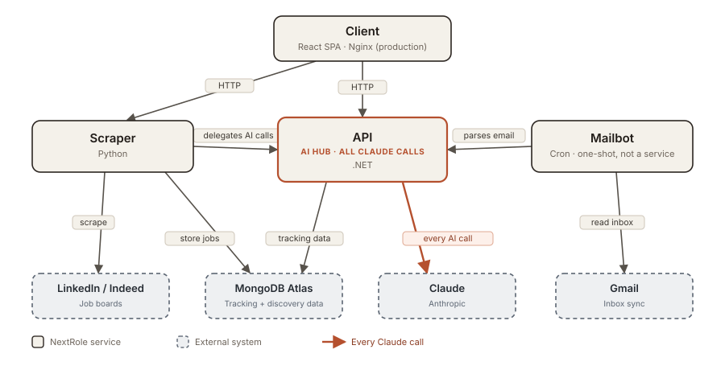
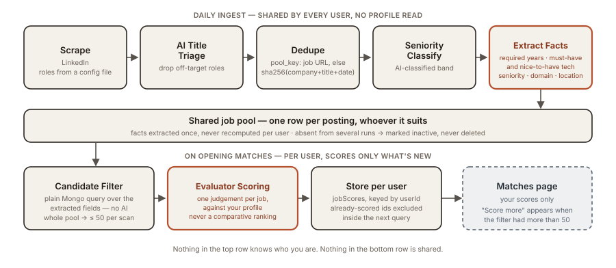
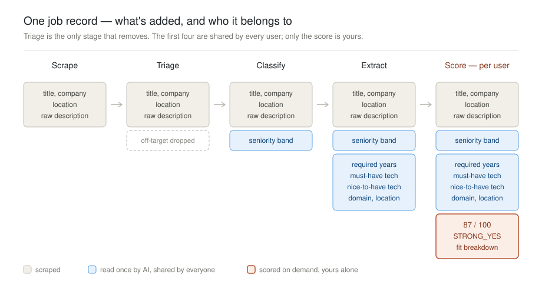

<picture>
  <source media="(prefers-color-scheme: dark)" srcset="docs/images/wordmark-dark.png">
  
</picture>
<br clear="left">


[](LICENSE)


Evaluating whether a job actually fits you means reading it closely, looking up the company, and cross-checking against your CV, strengths, values, and dealbreakers. You can't do that six hundred times. Every job you do apply to needs its own résumé. And once you've applied, replies get lost among dozens of emails.

**NextRole** is an AI-powered platform that runs your job hunt end-to-end: it discovers listings from LinkedIn into one shared pool, scores the ones that could plausibly fit you against your professional profile the moment you open the Matches tab, watches your inbox for replies, and tracks every role from first application to final outcome — with Claude working as analyst, evaluator, and interview coach along the way.

Built as a four-service monorepo (C#, Python, React), deployed to a single VPS via Docker Compose.

NextRole keeps three things: your profile, your own scores for the jobs it has shown you, and the board of what you're pursuing. The job pool itself is shared — what a posting *says* is read once for everybody; what it's *worth* is yours. The board feeds the mailbot — it knows which companies to watch in Gmail because they're on it.

**A typical morning takes five minutes**: open Matches, scan what came in overnight, add what looks good, glance at replies. The board is already up to date.

> **Multi-user, no login** — a `uid` cookie is your identity: upload a CV and you're in. No password, no account, no recovery. Two deployments run from one image and differ **only by configuration** — `private.nextrole.cloud` serves a single configured user, `nextrole.cloud` serves many.

> **Cost**: Claude (Anthropic) is pay-as-you-go — running your own instance has an ongoing cost proportional to how much you scrape, not a one-time fee. MongoDB Atlas's free tier is enough to get started.

> **Try it live**: [nextrole.cloud](https://nextrole.cloud) is the open instance — no signup, no login; drop in a CV and the shared job pool gets scored for you. A read-only seeded demo is also a supported configuration if you want to host a public instance over fictional data. See [Public instance](#public-instance).

### Contents

[Highlighted Features](#highlighted-features) · [Architecture](#architecture) · [Public Instance](#public-instance) · [Getting Started](#getting-started) · [Testing](#testing) · [Deployment & CI/CD](#deployment--cicd) · [Contributing](#contributing) · [License](#license)

---

## Highlighted Features

### Per-user job scoring, on demand

Ingest doesn't score. The pool is shared by everyone and a score is an opinion about one candidate — so when you open Matches, a cheap database filter over each posting's already-extracted requirements (location, seniority, tech overlap) narrows the pool to a plausible handful, and only those are scored against your profile: a full breakdown (technical fit, execution fit, sustainability) and a verdict from STRONG_YES to STRONG_NO, not a similarity ranking. Scores are stored per user, so a second visit only pays for what's new. [Details](#job-discovery--scoring)


### Application tracking

The Active board tracks every role you're pursuing through four columns — Added, Ready, Applied, Interviewing — with Generate Pack and status updates one click away. (Ready is Added with a résumé pack already generated; Interviewing groups the phone-screen, technical, and final-round stages.) Open any card for the full AI Analysis breakdown (technical / execution / sustainability) behind it.


### Interview practice

Author self-presentations and a Q&A rubric, then rehearse from AI-distilled keyword cues drawn straight from your prepared answers.


A few more things NextRole does:

- **Automated job discovery**: A daily cron scrapes LinkedIn for a role list held in a config file — not anyone's saved search — into one shared pool. Listings are deduplicated by URL (or company + title + date), and one absent from several consecutive runs is marked inactive, never deleted. Each posting's stated requirements are read once, user-independently, and reused for every user.
- **Manual scoring**: Paste any single job description and get a weighted compatibility score with a sub-component breakdown and an honest verdict. [Details](docs/scoring-and-search.md)
- **Email sync**: The mailbot detects interview invites, rejections, and offers in Gmail and updates the tracker automatically — idempotent, and it never moves an application backwards. [Details](#email-sync-mailbot)
- **Résumé upload**: Drop in a PDF and your profile is normalized automatically — the PDF goes to Claude natively, no extraction library.
- **Generate Pack**: A one-click, AI-tailored résumé PDF per application — reorders and re-emphasizes your real profile toward that job's description, never invents facts, and renders on demand (nothing stored as a file). [Details](docs/resume-pack.md)
- **Prompt-injection defense**: Untrusted external data — job descriptions, scraped news, raw emails — is always XML-wrapped in the user message and kept out of the system prompt.

---

## Architecture

NextRole consists of four loosely-coupled services, communicating over HTTP:

1. **Client** — the React single-page app: Matches, scoring, interview prep, and the application tracker in one dashboard, behind an Nginx reverse proxy in production.
2. **API** — the unified backend and **the only service that calls Claude**: per-user job scoring (on demand and manual), email parsing, profile normalization, and all tracking data. It also owns identity: it resolves every request to a `Guid` and is the only service that issues the `uid` cookie. Keeping every AI call here keeps the API key and prompt logic in one place.
3. **Scraper** — the ingest engine: scrapes LinkedIn for the configured role list, filters titles with AI triage, classifies seniority, and reads each new posting's stated requirements once — delegating its AI needs to the API. It never scores, and never reads a profile.
4. **Mailbot** — a one-shot cron process (not a service): reads Gmail, has the API parse each email with Claude, and applies status/interview updates to the tracker.



**The life of a job** ties the parts together, and splits in two halves. Shared, once, at ingest: the scraper discovers it, AI triage checks the title is on-target, dedupe decides whether it's new, and Claude reads what the posting *asks for* — required years, must-have and nice-to-have tech, seniority, domain, location. Per user, later: when you open Matches, that extracted shape is filtered against you, and only the survivors are scored. Adding one copies it into the tracker database — and from there the mailbot keeps its status current from your inbox.

The diagrams below break the core engines down — *how* each feature moves data through the services (dashed nodes are external systems).

### Job discovery & scoring

This is how NextRole finds jobs and figures out which ones actually fit you — in two halves, split along the line between what's true of a posting and what's true of *you*.

**Daily ingest, shared by every user**: scrape the configured role list → AI title triage → dedupe on a stable key (the job URL, else `sha256(company + title + date)`) → seniority classification → **fact extraction**, one Claude pass that records what the posting asks for: required years, must-have and nice-to-have tech, seniority band, domain, location. No profile is read and nothing is scored, which is exactly what makes one stored result valid for everybody. A posting missing from several consecutive runs is marked inactive; nothing is ever deleted.

**On demand, per user**: opening Matches runs a cheap Mongo filter over those extracted fields — location, seniority, tech overlap — which cuts the pool to a few dozen plausible candidates, capped at 50 per scan. Only those go to the Evaluator, one full judgement each against your profile. Results are written to `jobScores` keyed by user, and already-scored jobs are excluded inside the query, so a second visit scores only what arrived since the last one. When the filter has more than a scan's worth, the page says so and offers to score the next batch.

The split is what makes the pool affordable to share. A real run over the five seed roles found **167 unique postings**, and the one-off extraction over all of them cost **$0.33 — about $0.002 a job** (Haiku). Steady state is larger (that measurement covered a 72-hour window against a 60-day retention), but the number is small enough that a cheap field filter beats a vector index: [no vector DB](docs/job-pool.md).

Company/news enrichment — live web retrieval (Glassdoor ratings, recent company news) injected into the prompt, RAG by search rather than by embedding — still exists, but only on the manual scoring path and the legacy criteria-driven ingest it was built for. The shared pool doesn't enrich: a Glassdoor rating is a fact about a company, not about the fit, and paying for it 167 times a day to influence a score nobody has asked for yet is the trade the on-demand split was made to avoid.





### Email sync (Mailbot)

Keeps your tracker up to date without you lifting a finger. A one-shot cron process: pull active applications, parse the last 24 h of Gmail with Claude, and apply status/interview updates — matched by company + title, idempotent, and never moving an application backwards.

<picture>
  <source media="(prefers-color-scheme: dark)" srcset="docs/images/flow-mailbot-dark.svg">
  
</picture>

---

## Public instance

[**nextrole.cloud**](https://nextrole.cloud) runs the same image as the private instance against its own database, with `Identity:Mode=Cookie`: your first request gets a `uid` cookie (HttpOnly, Secure, SameSite=Lax, one year) and your first document appears when you upload a CV — not before. There is no password, no account recovery, and no link to share; lose the cookie and you're a new user. Everything you create — profile, scores, packs, the board — is filtered by that id, and the job pool underneath is the one thing everybody shares. Quotas keep the AI spend bounded (3 résumé packs per user per day). [Details](docs/multi-user.md)

`DemoMode=true` is the other way to expose an instance publicly: seeded fictional data, live AI scoring and reads, and every write blocked with a read-only banner — reseeded from `dotnet run --project server/api/src/Seeder`, safe to re-run any time. Use it when you want a public instance nobody can change. [Details](docs/demo-mode.md) · [Hosting your own](docs/hosting-a-public-demo.md)

---

## Getting started

For the Docker path you only need [Docker](https://www.docker.com/), a [MongoDB](https://www.mongodb.com/) instance (Atlas free tier works), and an [Anthropic API key](https://console.anthropic.com/):

```bash
export ANTHROPIC_API_KEY=your-key-here
export MONGODB_CONNECTION_STRING=mongodb://your-connection-string

docker compose up --build
```

Open [http://localhost:3000](http://localhost:3000).

Running services individually ([.NET 10 SDK](https://dotnet.microsoft.com/download), [Python 3.12+](https://www.python.org/), [Bun](https://bun.sh/)), the optional integrations (scraper, Gmail sync), the daily ingest cron, and every environment variable are covered in the **[Getting Started Guide](docs/getting-started.md)**.

---

## Testing

**Unit / component (frontend)** — Vitest + Testing Library:

```bash
cd client && bunx vitest run
```

**End-to-end** — Playwright (in `/e2e`):

```bash
cd e2e && npx playwright test --reporter=line
```

> ⚠️ **Stop your dev servers first.** Playwright's `webServer` config reuses existing servers when not in CI, so a running dev stack on `:5002/:8000/:5173` makes the suite run against your dev databases instead of the disposable test DBs (`job-tracker-test` / `jobmatch-test`).

---

## Deployment & CI/CD

Each service has its own GitHub Actions workflow with **path-based triggers** — a push to `main` touching a service's directory builds and deploys only that service:

| Workflow | Trigger path | Builds | Deploys |
|----------|-------------|--------|---------|
| `api.yml` | `server/api/**` | Docker image → `ghcr.io` | SSH → Hetzner VPS |
| `scraper.yml` | `server/scraper/**` | Docker image → `ghcr.io` | SSH → Hetzner VPS |
| `mailbot.yml` | `server/mailbot/**` | Docker image → `ghcr.io` | SSH → Hetzner VPS (cron profile) |
| `frontend.yml` | `client/**` | Docker image → `ghcr.io` | SSH → Hetzner VPS |

Each pipeline logs into GHCR, builds the service's Dockerfile, tags `:latest`, then SSHes into the VPS and runs `docker compose pull` + `docker compose up -d --force-recreate` for that service. The public instance (`nextrole.cloud`), the Basic-Auth-gated private frontend, and the private API all run as separate Compose services on the same box, **differing only in environment variables** — identity mode included. Note that `Identity:FixedUserId` is set once per deployment and can't be changed afterwards without a second migration (`deploy/README.md`).

---

## Contributing

This started as a personal tool and is now open for others to use, fork, or extend. Issues and pull requests are welcome — see [`AGENTS.md`](AGENTS.md) for the codebase's conventions and the docs in [`/docs`](docs) for how each feature works under the hood.

## License

[FSL-1.1-MIT](LICENSE) — converts to plain MIT two years after each version is released.

---

<sub>Built by Ozz Shpigel. NextRole is a personal project — see [`project-scope.md`](project-scope.md) and [`implementation-plan.md`](implementation-plan.md) for the original brief.</sub>
