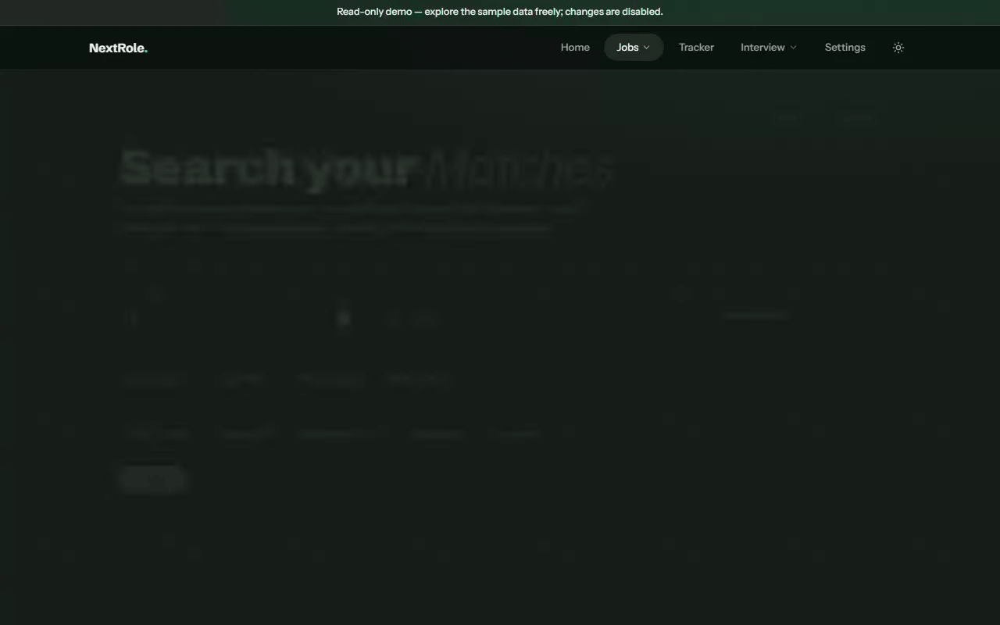
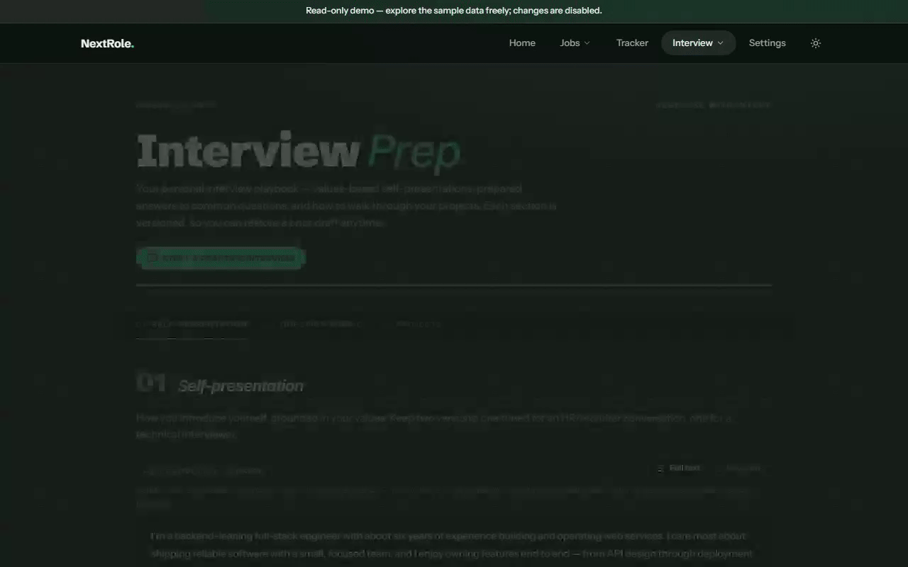

<picture>
  <source media="(prefers-color-scheme: dark)" srcset="docs/images/wordmark-dark.png">
  
</picture>
<br clear="left">


[](LICENSE)


**NextRole** is an AI-powered platform that runs your job hunt end-to-end: it discovers listings from LinkedIn and Indeed, scores every one against your professional profile as it's found, watches your inbox for replies, and tracks every role from first application to final outcome — with Claude working as analyst, evaluator, and interview coach along the way.

Built as a four-service monorepo (C#, Python, React), deployed to a single VPS via Docker Compose.

> **Single-tenant by design** — one user, no login. NextRole is your private tool, running against your own database.

> **Cost**: Claude (Anthropic) is pay-as-you-go — running your own instance has an ongoing cost proportional to how much you scrape, not a one-time fee. MongoDB Atlas's free tier is enough to get started.

> **Try it live**: [nextrole.cloud](https://nextrole.cloud) is a public read-only demo — a seeded fictional profile, real AI scoring, no login, nothing you do there is saved. See [Public demo](#public-demo).

### Contents

[Highlighted Features](#highlighted-features) · [Architecture](#architecture) · [Public Demo](#public-demo) · [Getting Started](#getting-started) · [Testing](#testing) · [Deployment & CI/CD](#deployment--cicd) · [Contributing](#contributing) · [License](#license)

---

## Highlighted Features

### Ingest-time job scoring

Every collected job is scored against your profile the moment it's discovered — a full breakdown (technical fit, execution fit, sustainability) and a verdict from STRONG_YES to STRONG_NO, not a similarity ranking. The Matches page is a filtered, sorted browse over what's already been scored. [Details](#job-discovery--scoring)



### Application tracking

Every save, application, and status update lives in one dashboard — response rate and average score at a glance, a running activity feed, and a per-application AI Analysis breakdown (technical / execution / sustainability) behind every tracked role.


### Interview practice

Author self-presentations and a Q&A rubric, rehearse from AI-distilled keyword cues, then run turn-by-turn mock interviews whose debrief feeds back into your prep. [Details](#mock-interview-stateless-turn-engine)



A few more things NextRole does:

- **Automated job discovery**: Search criteria (titles, locations, boards) run on a daily cron — the system scrapes LinkedIn/Indeed, drops off-target titles with AI triage, and embeds everything for search.
- **AI job scoring**: Paste any job description and get a weighted compatibility score with a sub-component breakdown and an honest verdict. [Details](docs/scoring-and-search.md)
- **Email sync**: The mailbot detects interview invites, rejections, and offers in Gmail and updates the tracker automatically — idempotent, and it never moves an application backwards. [Details](#email-sync-mailbot)
- **Résumé upload**: Drop in a PDF and your profile is normalized automatically — the PDF goes to Claude natively, no extraction library.
- **Generate Pack**: A one-click, AI-tailored résumé PDF per application — reorders and re-emphasizes your real profile toward that job's description, never invents facts, and renders on demand (nothing stored as a file). [Details](docs/resume-pack.md)
- **Mock interview**: Turn-by-turn AI interview practice — the client replays the whole transcript each turn so the server stays stateless, and the debrief can feed rewrites straight back into your prep rubric. [Details](#mock-interview-stateless-turn-engine)
- **Prompt-injection defense**: Untrusted external data — job descriptions, scraped news, raw emails — is always XML-wrapped in the user message and kept out of the system prompt.

---

## Architecture

NextRole consists of four loosely-coupled services, communicating over HTTP:

1. **Client** — the React single-page app: Matches, scoring, interview prep, and the application tracker in one dashboard, behind an Nginx reverse proxy in production.
2. **API** — the unified backend and **the only service that calls Claude**: job scoring (manual and ingest-time batched), email parsing, profile normalization, and all tracking data. Keeping every AI call here keeps the API key and prompt logic in one place.
3. **Scraper** — the ingest engine: scrapes LinkedIn/Indeed, filters titles with AI triage, classifies seniority, and scores every relevant job against your profile in batches — delegating its AI needs to the API.
4. **Mailbot** — a one-shot cron process (not a service): reads Gmail, has the API parse each email with Claude, and applies status/interview updates to the tracker.

<picture>
  <source media="(prefers-color-scheme: dark)" srcset="docs/images/architecture-dark.svg">
  
</picture>

> Diagram note: the SVGs above still depict the retired vector-search/OpenAI-embeddings flow — pending a redraw to match the ingest-time batched-scoring architecture described in the text.

**The life of a job** ties the parts together: the scraper discovers it, AI triage checks the title is on-target, and it's scored against your profile — in batches of up to 5, one shared Claude call per batch — the moment it's found. Saving a result copies it into the tracker database — and from there the mailbot keeps its status current from your inbox.

The diagrams below break the three core engines down — *how* each feature moves data through the services (dashed nodes are external systems).

### Job discovery & scoring

This is how NextRole finds jobs and figures out which ones actually fit you, in one pass — no separate on-demand search step. **Per discovery run**: scrape → AI title triage → seniority classification → company/news enrichment prefetch → batched Evaluator scoring (up to 5 jobs sharing one Claude call, each still judged independently against your profile) → store. The Matches page then just filters and sorts what's already been scored.

The enrichment prefetch step is still retrieval-augmented generation — it's just retrieval by live web search (Glassdoor ratings, recent company news) rather than vector similarity: no embeddings, no vector index, nothing pre-indexed. Each job's scoring call gets whatever the web search actually turned up for that company, injected straight into the Evaluator's prompt alongside your profile.

<picture>
  <source media="(prefers-color-scheme: dark)" srcset="docs/images/flow-search-dark.svg">
  
</picture>

> Diagram note: the SVG above still depicts the retired vector-search/advisor flow — pending a redraw.

### Mock interview (stateless turn engine)

Practice interviews with Claude playing the interviewer, one question at a time. The client holds the whole transcript and **replays it every turn** — the server keeps no session state. Trusted context (profile, prep) goes in the system prompt; untrusted data (job context, the transcript) is XML-wrapped in the user message. Cheap Haiku per turn, Sonnet once for the debrief.

<picture>
  <source media="(prefers-color-scheme: dark)" srcset="docs/images/flow-mock-interview-dark.svg">
  
</picture>

### Email sync (Mailbot)

Keeps your tracker up to date without you lifting a finger. A one-shot cron process: pull active applications, parse the last 24 h of Gmail with Claude, and apply status/interview updates — matched by company + title, idempotent, and never moving an application backwards.

<picture>
  <source media="(prefers-color-scheme: dark)" srcset="docs/images/flow-mailbot-dark.svg">
  
</picture>

---

## Public demo

[**nextrole.cloud**](https://nextrole.cloud) runs the same image as a private instance, pointed at a separate database of seeded fictional data instead of a real one — no signup, no login. AI scoring, the mock interview, and every read are fully live; anything that would persist a change to the tracker (adding an application, generating a pack, saving profile edits) is blocked with a read-only banner. It's reseeded from `dotnet run --project server/api/src/Seeder`, which is safe to re-run any time. [Details](docs/demo-mode.md) · [Hosting your own](docs/hosting-a-public-demo.md)

---

## Getting started

For the Docker path you only need [Docker](https://www.docker.com/), a [MongoDB](https://www.mongodb.com/) instance (Atlas free tier works), and an [Anthropic API key](https://console.anthropic.com/):

```bash
export ANTHROPIC_API_KEY=your-key-here
export MONGODB_CONNECTION_STRING=mongodb://your-connection-string

docker compose up --build
```

Open [http://localhost:3000](http://localhost:3000).

Running services individually ([.NET 10 SDK](https://dotnet.microsoft.com/download), [Python 3.12+](https://www.python.org/), [Bun](https://bun.sh/)), the optional integrations (scraper, Gmail sync), the daily ingest cron, and every environment variable are covered in the **[Getting Started Guide](docs/getting-started.md)**.

---

## Testing

**Unit / component (frontend)** — Vitest + Testing Library:

```bash
cd client && bunx vitest run
```

**End-to-end** — Playwright (in `/e2e`):

```bash
cd e2e && npx playwright test --reporter=line
```

> ⚠️ **Stop your dev servers first.** Playwright's `webServer` config reuses existing servers when not in CI, so a running dev stack on `:5002/:8000/:5173` makes the suite run against your dev databases instead of the disposable test DBs (`job-tracker-test` / `jobmatch-test`).

---

## Deployment & CI/CD

Each service has its own GitHub Actions workflow with **path-based triggers** — a push to `main` touching a service's directory builds and deploys only that service:

| Workflow | Trigger path | Builds | Deploys |
|----------|-------------|--------|---------|
| `api.yml` | `server/api/**` | Docker image → `ghcr.io` | SSH → Hetzner VPS |
| `scraper.yml` | `server/scraper/**` | Docker image → `ghcr.io` | SSH → Hetzner VPS |
| `mailbot.yml` | `server/mailbot/**` | Docker image → `ghcr.io` | SSH → Hetzner VPS (cron profile) |
| `frontend.yml` | `client/**` | Docker image → `ghcr.io` | SSH → Hetzner VPS |

Each pipeline logs into GHCR, builds the service's Dockerfile, tags `:latest`, then SSHes into the VPS and runs `docker compose pull` + `docker compose up -d --force-recreate` for that service. The public demo (`nextrole.cloud`), the Basic-Auth-gated private frontend, and the private API all run as separate Compose services on the same box, differing only in environment variables.

---

## Contributing

This started as a personal tool and is now open for others to use, fork, or extend. Issues and pull requests are welcome — see [`AGENTS.md`](AGENTS.md) for the codebase's conventions and the docs in [`/docs`](docs) for how each feature works under the hood.

## License

[FSL-1.1-MIT](LICENSE) — converts to plain MIT two years after each version is released.

---

<sub>Built by Ozz Shpigel. NextRole is a personal project — see [`project-scope.md`](project-scope.md) and [`implementation-plan.md`](implementation-plan.md) for the original brief.</sub>
