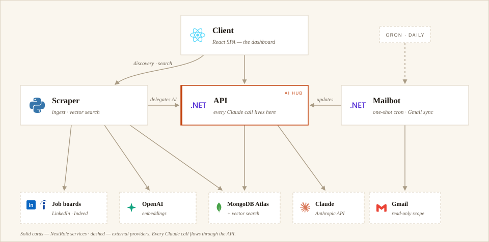
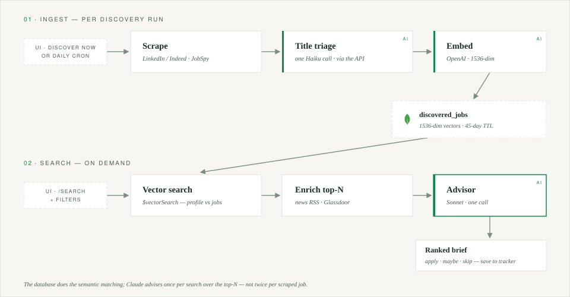
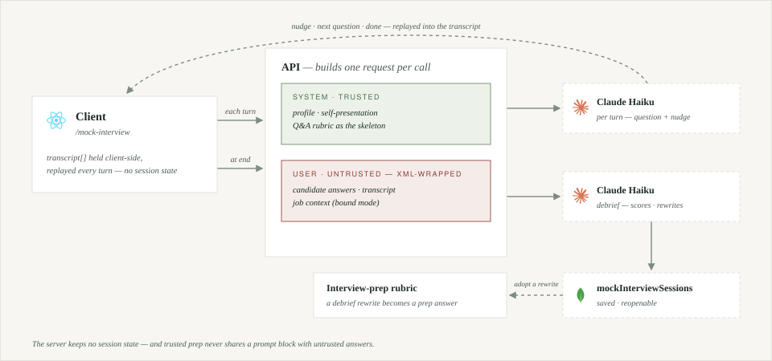
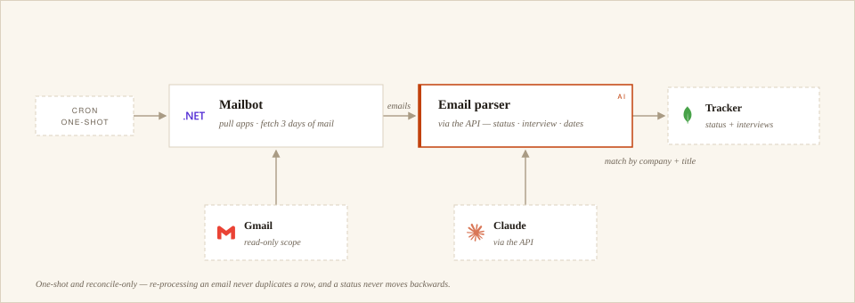

# NextRole

**NextRole** is an AI-powered platform that runs your job hunt end-to-end: it discovers listings from LinkedIn and Indeed, matches them to your professional profile *by meaning*, watches your inbox for replies, and tracks every role from first application to final outcome — with Claude working as analyst, career advisor, and interview coach along the way.

Built as a four-service monorepo (C#, Python, React), deployed to production on Render.

> **Single-tenant by design** — one user, no login. NextRole is your private tool, running against your own database.

---

## Highlighted Features

1. **Semantic job search (RAG)**: Every collected job is matched against your profile *by meaning* via MongoDB Atlas Vector Search, and a single Claude "career advisor" call ranks the results with apply/maybe/skip verdicts. [Details](#job-discovery--semantic-search)
2. **Automated job discovery**: Define search criteria once — the system scrapes LinkedIn/Indeed, drops off-target titles with AI triage, and embeds everything for search, from the UI or a daily cron.
3. **AI job scoring**: Paste any job description and get a weighted compatibility score with a sub-component breakdown and an honest verdict. [Details](docs/scoring-and-search.md)
4. **Email sync**: The mailbot detects interview invites, rejections, and offers in Gmail and updates the tracker automatically — idempotent, and it never moves an application backwards. [Details](#email-sync-mailbot)
5. **Interview practice**: Author self-presentations and a Q&A rubric, rehearse from AI-distilled keyword cues, then run turn-by-turn mock interviews whose debrief feeds back into your prep. [Details](#mock-interview-stateless-turn-engine)
6. **Résumé upload**: Drop in a PDF and your profile is normalized automatically — the PDF goes to Claude natively, no extraction library.
7. **Prompt-injection defense**: Untrusted external data — job descriptions, scraped news, raw emails — is always XML-wrapped in the user message and kept out of the system prompt.

---

## Architecture

NextRole consists of four loosely-coupled services, communicating over HTTP:

1. **Client** — the React single-page app: discovery, semantic search, scoring, interview prep, and the application tracker in one dashboard, behind an Nginx reverse proxy in production.
2. **API** — the unified backend and **the only service that calls Claude**: job scoring, the search advisor, email parsing, profile normalization, and all tracking data. Keeping every AI call here keeps the API key and prompt logic in one place.
3. **Scraper** — the ingest & search engine: scrapes LinkedIn/Indeed, filters titles with AI triage, embeds jobs, and serves semantic matching via MongoDB Atlas `$vectorSearch` — delegating its AI needs to the API.
4. **Mailbot** — a one-shot cron process (not a service): reads Gmail, has the API parse each email with Claude, and applies status/interview updates to the tracker.

<picture>
  <source media="(prefers-color-scheme: dark)" srcset="docs/images/architecture-dark.svg">
  
</picture>

**The life of a job** ties the parts together: the scraper discovers it, AI triage checks the title is on-target, its text is embedded, and it lands in `discovered_jobs` (a 1536-dim vector, 45-day TTL). When you search, your profile is embedded too, `$vectorSearch` surfaces the closest jobs, and **one** Claude *advisor* call ranks the top-N with apply/maybe/skip verdicts. Saving a result copies it into the tracker database — and from there the mailbot keeps its status current from your inbox.

The diagrams below break the three core engines down — *how* each feature moves data through the services (dashed nodes are external systems).

### Job discovery & semantic search

Two decoupled halves. **Ingest** (per discovery run): scrape → AI title triage → embed → store. **Search** (on demand): the DB does the semantic matching, and Claude runs **once** over the top-N as a career advisor — instead of two Claude calls per scraped job.

<picture>
  <source media="(prefers-color-scheme: dark)" srcset="docs/images/flow-search-dark.svg">
  
</picture>

### Mock interview (stateless turn engine)

The client holds the whole transcript and **replays it every turn** — the server keeps no session state. Trusted context (profile, prep) goes in the system prompt; untrusted data (job context, the transcript) is XML-wrapped in the user message. Cheap Haiku per turn, Sonnet once for the debrief.

<picture>
  <source media="(prefers-color-scheme: dark)" srcset="docs/images/flow-mock-interview-dark.svg">
  
</picture>

### Email sync (Mailbot)

A one-shot cron process: pull active applications, parse the last 24 h of Gmail with Claude, and apply status/interview updates — matched by company + title, idempotent, and never moving an application backwards.

<picture>
  <source media="(prefers-color-scheme: dark)" srcset="docs/images/flow-mailbot-dark.svg">
  
</picture>

---

## Getting started

For the Docker path you only need [Docker](https://www.docker.com/), a [MongoDB](https://www.mongodb.com/) instance (Atlas free tier works), and an [Anthropic API key](https://console.anthropic.com/):

```bash
export ANTHROPIC_API_KEY=your-key-here
export MONGODB_CONNECTION_STRING=mongodb://your-connection-string

docker compose up --build
```

Open [http://localhost:3000](http://localhost:3000).

Running services individually ([.NET 10 SDK](https://dotnet.microsoft.com/download), [Python 3.12+](https://www.python.org/), [Bun](https://bun.sh/)), the optional integrations (scraper, Gmail sync), the daily ingest cron, and every environment variable are covered in the **[Getting Started Guide](docs/getting-started.md)**.

---

## Testing

**Unit / component (frontend)** — Vitest + Testing Library:

```bash
cd client && bunx vitest run
```

**End-to-end** — Playwright (in `/e2e`):

```bash
cd e2e && npx playwright test --reporter=line
```

> ⚠️ **Stop your dev servers first.** Playwright's `webServer` config reuses existing servers when not in CI, so a running dev stack on `:5002/:8000/:5173` makes the suite run against your dev databases instead of the disposable test DBs (`job-tracker-test` / `jobmatch-test`).

---

## Deployment & CI/CD

Each service has its own GitHub Actions workflow with **path-based triggers** — a push to `main` touching a service's directory builds and deploys only that service:

| Workflow | Trigger path | Builds | Deploys |
|----------|-------------|--------|---------|
| `api.yml` | `server/api/**` | Docker image → `ghcr.io` | Render webhook |
| `scraper.yml` | `server/scraper/**` | Docker image → `ghcr.io` | Render webhook |
| `mailbot.yml` | `server/mailbot/**` | Docker image → `ghcr.io` | Render webhook |
| `frontend.yml` | `client/**` | Docker image → `ghcr.io` | Render webhook |

Each pipeline logs into GHCR, builds the service's Dockerfile, tags `:latest`, and triggers a Render deploy.

---

<sub>Built by Ozz Shpigel. NextRole is a personal project — see [`project-scope.md`](project-scope.md) and [`implementation-plan.md`](implementation-plan.md) for the original brief.</sub>
