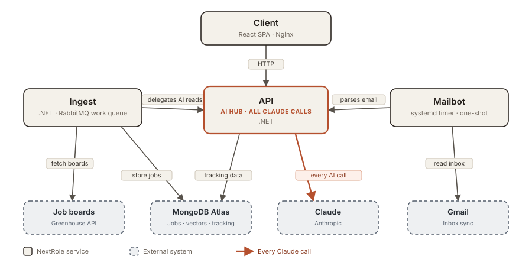
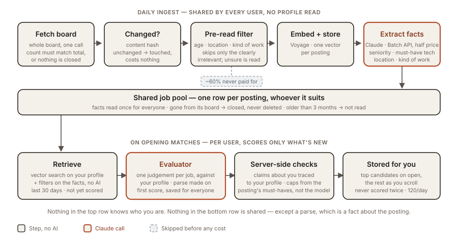
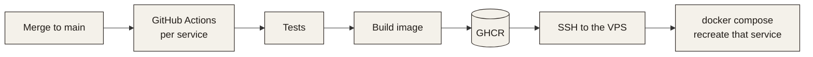
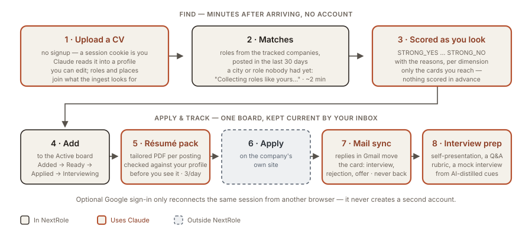

<picture>
  <source media="(prefers-color-scheme: dark)" srcset="docs/images/wordmark-dark.png">
  
</picture>
<br clear="left">

[](LICENSE)


**NextRole is an AI job-search platform, built and run in production by one engineer.** Upload a CV and it shows you open roles from the companies it tracks — each scored against *your* profile, with an honest verdict and the reasons behind it — then tracks what you apply to and follows the replies in your Gmail.

**Live:** [nextrole.cloud](https://nextrole.cloud) — drop in a CV, no signup.

<p align="center">
  <picture>
    <source media="(prefers-color-scheme: dark)" srcset="docs/images/pipeline-scene-dark.svg">
    
  </picture>
</p>

This README is written for an engineer reviewing the project: what it does in one screen, how it runs, and the decisions worth talking about. Feature-level detail lives in [`docs/`](docs).

---

## In one minute

- **One shared job pool, read once.** A daily ingest pulls postings straight from companies' job boards (26 companies on Greenhouse today), skips what no user could want, and has Claude extract each posting's requirements **once, for everybody**.
- **Scoring is per user and on demand.** Nothing is scored at ingest — a score is an opinion about one candidate. When you open Matches, a vector search plus cheap filters narrow the pool to a handful, and only those are scored against your profile.
- **Built to cost cents, and to fail loudly.** Most of the engineering is in not paying for work nobody sees, and in making sure a failure can never look like success.

| | |
|---|---|
| Services | .NET 10 API · React 19 SPA · .NET ingest (publisher + consumer) · .NET mail worker |
| Data | MongoDB Atlas (documents + vector index) · Voyage embeddings |
| AI | Anthropic Claude — Haiku for reads and scoring, Sonnet for résumé packs |
| Runtime | One Hetzner VPS · Docker Compose · Caddy (TLS) · RabbitMQ · systemd timers |
| Delivery | GitHub Actions per service → GHCR → SSH deploy. **Merging to `main` is the deploy.** |
| Observability | Grafana + Loki + Promtail · a run ledger per ingest run |

---

## Architecture



- **The API is the only service that talks to Claude** — one key, one prompt configuration, one set of rate limits. The ingest and the mail worker call the API instead of holding a key.
- **The ingest is a work queue.** The publisher puts one message per company on RabbitMQ; a long-running consumer fetches that board, filters, embeds, stores, and acks only after the write. A crash mid-company just redelivers it, and a content-hash skip makes the redo nearly free. Poison messages go to a dead-letter queue.
- **Retrieval is a vector search**, over one embedding per posting, followed by server-side filters on facts the ingest already extracted (location, seniority, kind of work, age).

### The life of a posting: shared ingest, per-user scoring



---

## Running it in production


```mermaid
flowchart LR
    M["Merge to main"] --> G["GitHub Actions<br/>per service"] --> T["Tests"] --> B["Build image"] --> H[("GHCR")] --> V["SSH to the VPS"] --> U["docker compose<br/>recreate that service"]

    classDef svc fill:#f4f1ea,stroke:#2b2521,color:#211c18
    class M,G,T,B,H,V,U svc
```

- **Deploy:** each service has its own GitHub Actions workflow with path-based triggers. A merge touching `server/api/**` builds that image, pushes it to GHCR, SSHes to the VPS and recreates only that service. The ingest image is built from the **same commit** as the API, because both must agree on the embedding model — a mismatch would silently return no results.
- **Schedules:** systemd timers on the box — the daily ingest publish and the mail sync. Long-running services are Compose services with restart policies.
- **Server config is not in CI** (`deploy/`): Compose files, systemd units and monitoring config are manual state on the box — documented in [`docs/deploying.md`](docs/deploying.md), because it has bitten twice.
- **Secrets** live in env files on the box; the Atlas credentials are least-privilege per service ([`docs/hosting.md`](docs/hosting.md)).
- **Backups before destructive work:** retiring the old LinkedIn pool (222 MB of the 512 MB free tier) went backup → verify by restoring locally and matching every collection's count → delete → reclaim.

---

## Engineering decisions worth discussing

**Pay only for what someone can see.**
A pre-read filter runs before any Claude call, using only what the job board returns for free (title, location, department, posting date). It skips a posting only when it is *clearly* irrelevant — older than anything Matches shows, somewhere no user is, or a kind of work no user wants — and anything uncertain is read. Measured on the first 20 companies added: **~60% of new postings never read or stored**. What is read goes through Anthropic's Message Batches API at **half price**, and the expensive per-posting parse is made only when the first user actually scores that posting, then saved for everyone after.

**A failed fetch is not an empty board.**
If a job board fetch is partial or fails, closing "the jobs that disappeared" would close all of them. So the board client *throws* on a bad status, an unparseable body, or a count that doesn't match the board's own total — the close diff is unreachable rather than guarded by a flag. The same rule shapes every other destructive step: removed companies are closed (never deleted, and reopened for free if re-added), and a config that would close more than half the pool at once is refused.

**Measure before acting — and check what the measurement can see.**
The filter shipped in log-only mode: it logged what it *would* skip and compared its guesses with the labels Claude had already put on stored postings, and was switched on only when "would hide a wanted posting" read 0. Later boards exposed a limit of that check — it cannot see postings it skipped, because they were never stored — so the new boards were audited by hand (284 skipped titles, 0 engineering roles among them).

**Checks the model can't talk its way past.**
Anything the model writes about the candidate is verified server-side against the real profile ("Kubernetes — perfect match" on a CV without it gets flagged), and the numbers that cap a score are computed from extracted requirements, not from the model's own account. Untrusted text (job descriptions, emails) is always XML-wrapped in the user message, never in the system prompt.

**Bugs found from production evidence, each closed with a regression test.**
Two examples: stored parses were written in camelCase and read expecting PascalCase, so *none* was ever read back — every one paid for twice (found by measuring 0 of 20 read). And the eager scan and scroll-scoring each had a concurrency guard the other couldn't see, so a new user's first visit was scored twice (found in the API logs; the regression tests were confirmed to fail on the old code).

**Growing sources without forking the pipeline.**
Greenhouse is the first source, not the last — Workday hosts the largest Israeli employers. The plan ([`docs/plans/multi-source-ingest.md`](docs/plans/multi-source-ingest.md)) makes a source a small adapter behind one contract, with completeness proven per source, one text job key, exact-only de-duplication, and one contract test suite every adapter must pass.

---

## By the numbers

| | |
|---|---|
| Companies tracked | 26 (Greenhouse) |
| New postings skipped before any AI read | ~60% (first 20 companies) |
| Ingest reads | batched, 50% cheaper; parse only on first score |
| New kind of user → their roles on screen | ~2 min (request picked up in 14 s, run 91 s — measured in production) |
| Database after retiring the LinkedIn pool | 258 MB → 35 MB of data |
| Tests | ~290 ingest · ~320 architecture · ~180 frontend · Playwright e2e |

---

## What a user sees



 

- **Matches** — open roles from the tracked companies, scored for you (technical fit, execution fit, sustainability, a verdict from STRONG_YES to STRONG_NO); by default only roles posted in the last 30 days.
- **Active board** — Added → Ready → Applied → Interviewing, with a one-click **résumé pack** tailored to the posting (never inventing facts; validated before it is shown).
- **Mail sync** — interview invites, rejections and offers in Gmail move the card automatically, idempotently, never backwards.
- **Interview prep** — self-presentation and a Q&A rubric, rehearsed from AI-distilled cues.
- **No account needed** — a session cookie is the identity; Google sign-in only reconnects you to it from another browser ([`docs/auth.md`](docs/auth.md)).

---

## Run it locally

You need Docker, a MongoDB (the Atlas free tier works) and an Anthropic API key:

```bash
export ANTHROPIC_API_KEY=your-key
export MONGODB_CONNECTION_STRING=mongodb://your-connection-string
docker compose up --build        # then open http://localhost:3000
```

Running services individually, the ingest (defaults to one small board locally, to keep runs cheap), Gmail sync and every setting: [`docs/getting-started.md`](docs/getting-started.md).

**Tests**

```bash
dotnet test server/api/tests/GreenhouseTests -c Release     # ingest: guards, filters, sources
dotnet test server/api/tests/ArchitectureTests -c Release   # per-user scoping can't be bypassed; scoring rules
cd client && bunx vitest run                               # frontend
cd e2e && npx playwright test --reporter=line              # end-to-end (stop dev servers first)
```

---

## Where to read more

| Area | Doc |
|---|---|
| The ingest: boards, queue, pre-read filter, triggers, auto-close | [`docs/greenhouse.md`](docs/greenhouse.md) |
| Scoring: the evaluator, verdicts, claim checks | [`docs/scoring-and-search.md`](docs/scoring-and-search.md) |
| Multi-user: identity, per-user scoping | [`docs/multi-user.md`](docs/multi-user.md) · [`docs/auth.md`](docs/auth.md) |
| Deploying and operating the box | [`docs/deploying.md`](docs/deploying.md) · [`docs/hosting.md`](docs/hosting.md) |
| Résumé packs · mail sync · interview prep | [`docs/resume-pack.md`](docs/resume-pack.md) · [`docs/mailbot.md`](docs/mailbot.md) · [`docs/interview-prep.md`](docs/interview-prep.md) |
| Conventions the codebase holds itself to | [`AGENTS.md`](AGENTS.md) |

## License

[FSL-1.1-MIT](LICENSE) — converts to plain MIT two years after each version is released.

<sub>Built by Oz Shpigel.</sub>
