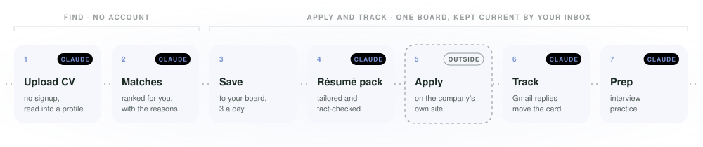
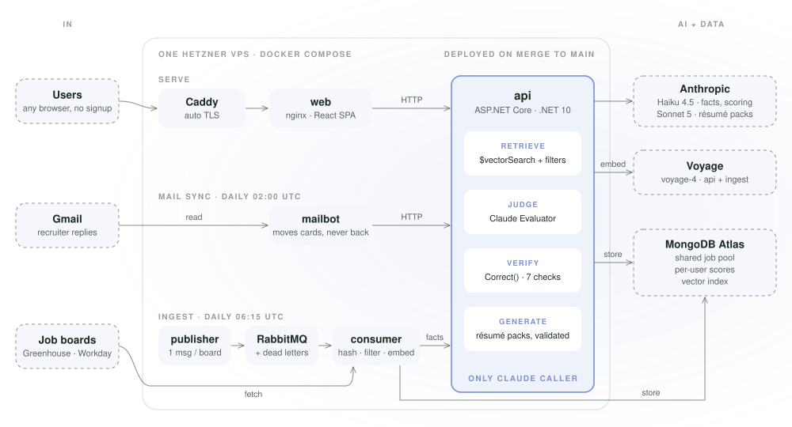

<picture>
  <source media="(prefers-color-scheme: dark)" srcset="docs/images/wordmark-dark.png">
  
</picture>
 

**An AI job search, from CV to offer.**

Upload a CV, get open roles from company job boards ranked for you, and track every application in one place.

Claude judges each match; code checks every judgement before you see it.

**Live at [nextrole.cloud](https://nextrole.cloud)**

  <picture>
    <source media="(prefers-color-scheme: dark)" srcset="docs/images/pipeline-scene-dark.svg">
    
  </picture>

## The problem

Job hunting is scattered. Postings live on many company sites, and keyword alerts match words instead of people.
So you still read every posting to judge whether it fits, which takes longer than most of them deserve.
Once you apply, progress hides in email threads and a spreadsheet you stop updating.
What's missing is one place that finds the roles that fit you and keeps track of them until the offer.

## What a user does

  <picture>
    <source media="(prefers-color-scheme: dark)" srcset="docs/images/journey-dark.svg">
    
  </picture>

## Architecture

  <picture>
    <source media="(prefers-color-scheme: dark)" srcset="docs/images/architecture-dark.svg">
    
  </picture>

One API is the only service that talks to Claude. The ingest and the mail sync go through it, so there is one key, one prompt config and one set of rate limits.

**Stack:** .NET 10 · React 19 · MongoDB Atlas with vector search · RabbitMQ · Claude Haiku 4.5 and Sonnet 5 · Voyage embeddings · Docker Compose on Hetzner · Caddy

## Core principle: the model judges, code verifies

AI is confident even when it's wrong, and a wrong match looks exactly like a right one. So Claude makes the judgement, and code checks it against the CV and the posting before anyone sees it.

  <picture>
    <source media="(prefers-color-scheme: dark)" srcset="docs/images/pipeline-dark.svg">
    
  </picture>

## How correctness is verified

- **Code overrides the model.** Every rule the model was caught breaking (ignoring score caps, claiming skills the CV lacks, answering YES past a dealbreaker) moved out of the prompt and into [`Correct()`](server/api/src/Core/Matching/JobMatchService.cs#L256).
- **Generated résumés are checked the same way.** One that states a figure the CV never stated is [blocked](server/api/src/Core/Models/ResumePackValidator.cs) before it reaches an employer.
- **A golden set measures the scorer.** An [eval harness](server/api/src/EvalHarness) runs 24 hand-labelled postings through the real API: **22/24**, stable over 3 runs.
- **Tests pin the silent failures.** 545 backend tests, including [one user can never read another's data](server/api/tests/ArchitectureTests), enforced by the type system rather than by care.

<!-- TODO: was the 22/24 baseline measured on Haiku? The fixture's labeledAt (2026-08-28) is after the Sonnet → Haiku switch (2026-08-11, ScoringConfig.cs:57), but the repo doesn't say which model ran it. -->
<!-- TODO: should each score store a trace keyed by prompt version and model? jobScores (JobScore.cs) stores neither; no ScoreTrace type exists. -->

## Decisions and trade-offs

| Chose | Over | Because |
|---|---|---|
| [Vector search inside MongoDB Atlas](docs/greenhouse.md) | a separate vector database | one database, no extra service; it only shortlists, it never scores |
| [Own sessions + optional Google sign-in](docs/auth.md) | Better Auth | no account needed to start, one source of truth for identity, no extra runtime |
| [Feature gating in config](docs/plans/feature-gating.md) | a feature-flag library | a handful of flags, enforced server-side |
| [Queue-driven ingest workers](docs/scraper-slimming.md) | a background job inside the API | a crash replays one company, and ingest never slows down users |
| [Reading company job boards directly](docs/greenhouse.md) | scraping LinkedIn | each board's completeness can be proven |
| [Haiku for scoring](server/api/src/Core/Profile/ScoringConfig.cs#L57) | Sonnet | cost; the checks in code don't depend on the model |

<!-- TODO: was a separate vector database (e.g. Qdrant) ever evaluated for the board source? Nothing in the repo records it; docs/job-pool.md only rules one out for the old LinkedIn pool. -->

## Running in production

One Hetzner VPS runs everything in Docker Compose behind Caddy with automatic TLS. Every merge to `main` tests, builds and redeploys only the service that changed. Logs go to Grafana and Loki, and health checks alert on Telegram. Runbook: [`docs/deploying.md`](docs/deploying.md).

## Status

Live at [nextrole.cloud](https://nextrole.cloud). Next: more job-board sources, paid tiers, and email and passkey sign-in.

**License:** [FSL-1.1-MIT](LICENSE). Each version becomes plain MIT two years after its release.
