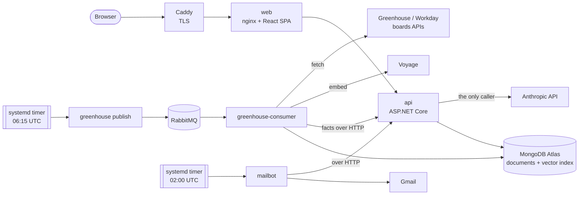

<picture>
  <source media="(prefers-color-scheme: dark)" srcset="docs/images/wordmark-dark.png">
  
</picture>
<br clear="left">

[](LICENSE)

**NextRole finds the open roles that fit your CV — Claude judges every match, and code checks every judgement against your actual CV before you see it.**
For engineers anywhere: upload a CV, no signup, and get roles from 36 company job boards, read daily, ranked against your profile.
Every score passes 7 server-side checks; the scorer is measured on a 24-case hand-labelled golden set (22/24, stable over 3 runs).
Built and run in production by one engineer — **live at [nextrole.cloud](https://nextrole.cloud)**.

<p align="center">
  <picture>
    <source media="(prefers-color-scheme: dark)" srcset="docs/images/pipeline-scene-dark.svg">
    
  </picture>
</p>

<p align="center"></p>

## The problem

The core of the product is a single LLM judgement: is this posting a fit for this person? An unchecked judgement fails in ways nobody sees:
- full marks (20/20) for core stack on a posting with 12 requirements the candidate lacks;
- a "Kubernetes — strong match" on a CV that never mentions Kubernetes;
- a failed board fetch that reads as "this company closed every job".

Most of the code exists to make those failures impossible or visible, and to keep the cost per user in cents.

## Architecture


```mermaid
flowchart LR
    U([Browser]) --> C[Caddy<br/>TLS] --> W[web<br/>nginx + React SPA] --> A[api<br/>ASP.NET Core]
    T1[[systemd timer<br/>06:15 UTC]] --> P[greenhouse publish] --> Q[(RabbitMQ)] --> GC[greenhouse-consumer]
    GC -->|fetch| B[Greenhouse / Workday<br/>boards APIs]
    GC -->|embed| V[Voyage]
    GC -->|facts over HTTP| A
    T2[[systemd timer<br/>02:00 UTC]] --> MB[mailbot] -->|over HTTP| A
    MB --> G[Gmail]
    A -->|the only caller| CL[Anthropic API]
    A --> M[(MongoDB Atlas<br/>documents + vector index)]
    GC --> M
```

**The API is the only service that holds an Anthropic key.** The ingest ([`IngestAiClient.cs`](server/api/src/Core/Matching/IngestAiClient.cs)) and the mail worker call it over HTTP, so there is one prompt config, one key, and one set of rate limits ([`AGENTS.md`](AGENTS.md)).

| Layer | Choice |
|---|---|
| Backend | .NET 10, ASP.NET Core API + three .NET console workers ([`server/api/src`](server/api/src), [`server/mailbot`](server/mailbot)) |
| Frontend | React 19, Vite, TypeScript, Tailwind v4, shadcn/ui, TanStack Query ([`client`](client)) |
| Data | MongoDB Atlas with Atlas Vector Search; Voyage `voyage-4` embeddings, 1024 dimensions ([`GreenhouseEmbeddingOptions.cs`](server/api/src/Core/Greenhouse/GreenhouseEmbeddingOptions.cs)) |
| AI | Anthropic: Haiku 4.5 for fact extraction and scoring, Sonnet 5 for résumé packs and narrative enrichment ([`appsettings.json`](server/api/src/Api/appsettings.json)) |
| Queue | RabbitMQ: one message per company board, dead-letter queue ([`docs/greenhouse.md`](docs/greenhouse.md)) |
| Runtime | Docker Compose on one Hetzner VPS, Caddy for automatic HTTPS ([`deploy/compose.yml`](deploy/compose.yml), [`deploy/Caddyfile`](deploy/Caddyfile)) |

## Core principle: let the model judge, verify in code

The model is good at reading a posting and a CV. It is unreliable at applying the consequences of its own reasoning. It names a dealbreaker and still answers YES, or it is told to cap a score and doesn't. So the model writes the judgement, and the C# layer computes every number that changes what the user sees, from data the model did not write.

The path a posting takes ([`docs/greenhouse.md`](docs/greenhouse.md), [`docs/scoring-and-search.md`](docs/scoring-and-search.md)):

| # | Stage | Where | What it guards |
|---|---|---|---|
| 1 | **Fetch and dedupe.** One call per board. A SHA-256 content hash skips unchanged postings. Listings are upserted on `(boardKey, sourceJobId)` and never deleted. | [`BoardHandler.cs`](server/api/src/Greenhouse/Work/BoardHandler.cs) | A failed or partial fetch *throws*, so it can never close a company's jobs |
| 2 | **Pre-read filter.** Skips postings no user could want, judged by age, location and function, before any paid call. | [`Prefilter.cs`](server/api/src/Greenhouse/Work/Prefilter.cs) | Switched on only after a hand-checked 116 postings: 109 right, 7 wrong, 0 that would hide a wanted role ([`docs/greenhouse.md`](docs/greenhouse.md#L337)) |
| 3 | **Fact extraction, once per posting, for everyone.** Haiku, in chunks of 12, optionally through the Message Batches API. Seniority and job function come from closed lists, and off-list values are dropped server-side. | [`PromptSeeds.cs`](server/api/src/Infrastructure/AI/PromptSeeds.cs#L346), [`ClaudeClient.cs`](server/api/src/Infrastructure/AI/ClaudeClient.cs#L721) | The scorer reads stored facts, so extraction is never repeated per user |
| 4 | **Retrieval per user.** Atlas `$vectorSearch` with the profile as the query, filtered on location and seniority. Mongo then filters for open postings, age, and facts present. | [`MongoCandidateJobStore.cs`](server/api/src/Infrastructure/Greenhouse/MongoCandidateJobStore.cs#L52), [`GreenhouseJobRepository.cs`](server/api/src/Infrastructure/Greenhouse/GreenhouseJobRepository.cs#L125) | Only a handful of postings reach a paid call |
| 5 | **Scoring.** The Haiku Evaluator runs at temperature 0, only on postings this user has never had scored, and the result is stored in per-user `jobScores`. Then `Correct()` runs. Part of it is a C# set intersection of the posting's must-have groups against the profile, which overwrites the model's own list of gaps. | [`JobMatchService.cs`](server/api/src/Core/Matching/JobMatchService.cs#L256), [`ClaimGrounding.cs`](server/api/src/Core/Matching/ClaimGrounding.cs#L119) | See the next section |

Nothing is scored at ingest. The pool is shared, and a score is an opinion about one candidate.

## How correctness is verified

### 1. Server-side corrections: `JobMatchService.Correct()`

Every score goes through [`Correct()`](server/api/src/Core/Matching/JobMatchService.cs#L256) before it is stored. Each step exists because an earlier prompt-only rule was measured failing.

| Step | Rule enforced in code | Why prompt prose wasn't enough |
|---|---|---|
| `EnforceReviewCaps` ([L398](server/api/src/Core/Matching/JobMatchService.cs#L398)) | The model returns `reviewAdjustment {base, delta}`. The server recomputes the score and clamps the delta. | The Evaluator ignored numeric caps stated in the prompt ([`MatchResponse.cs`](server/api/src/Core/Matching/MatchResponse.cs#L100)) |
| `GroundClaims` + `EnforceStackedGapsCap` | Missing requirements are computed from the extracted `must_have_tech` and the profile, not from the model's own list. Unsupported claims about the candidate are flagged as `UnsupportedClaims`. | One response listed 1 gap against 12 absent requirements and still scored 20/20 ([`AGENTS.md`](AGENTS.md)) |
| `EnforceHardBlockerScope` ([L685](server/api/src/Core/Matching/JobMatchService.cs#L685)) | Only two blocker kinds survive: the candidate's own dealbreakers, quoted from their profile, and work arrangement. | `people_management` was measured forcing STRONG_NO on five postings on one run and none on the next. It was removed, along with two filters that judged a posting's prose rather than a dealbreaker ([`HardBlockerScope.cs`](server/api/src/Core/Matching/HardBlockerScope.cs#L24)). |
| `hardBlockers` → verdict ([L273](server/api/src/Core/Matching/JobMatchService.cs#L273)) | Any surviving blocker forces `STRONG_NO` and `shouldApply = false`. The verdict is otherwise re-derived from the score bands. | The model identified the blocker in its reasoning but did not apply it to its own verdict field |

The same rule covers generated résumés. [`ResumePackValidator.cs`](server/api/src/Core/Models/ResumePackValidator.cs) repairs skills not in the profile, flags other unsupported claims, and **blocks** the pack on any figure the profile never stated, because a pack goes to an employer. It was measured against 53 real generations before it was allowed to block. One rule that fired 4 false refusals and 0 true positives was demoted to a flag ([L60–87](server/api/src/Core/Models/ResumePackValidator.cs#L60)).

### 2. Golden-set evaluation

[`server/api/src/EvalHarness`](server/api/src/EvalHarness) is a CLI that drives the real `POST /api/match` endpoint against a frozen profile.

- **Verdict eval:** [`fixtures/golden-set.json`](server/api/src/EvalHarness/fixtures/golden-set.json) has **24 hand-labelled cases**, 6 for each probe (blocker, technical, execution, sustainability).
  - The baseline is **22/24, stable across three consecutive runs at temperature 0**.
  - The three recurring misses are documented in each case's `why` field.
- **Subscore eval:** [`SubscoreEval.cs`](server/api/src/EvalHarness/SubscoreEval.cs) checks each sub-score lands in its expected band and that hard blockers fire only where expected.
- **The Evaluator was tuned on Sonnet first:** 45/45 pass-points over 3 runs. It then moved to Haiku because output tokens were ~88% of daily scoring spend ([`ScoringConfig.cs`](server/api/src/Core/Profile/ScoringConfig.cs#L57)).
  - TODO: was the 22/24 baseline measured on Haiku? The fixture's `labeledAt` (2026-08-28) is after the switch (2026-08-11), but the repo doesn't say which model ran it.

```bash
dotnet run --project server/api/src/EvalHarness -- verdict --runs 3
dotnet run --project server/api/src/EvalHarness -- subscore
```

TODO: Is there a stored trace of each score, keyed by rubric/prompt version and model? `jobScores` ([`JobScore.cs`](server/api/src/Core/Models/JobScore.cs)) stores no model or prompt version. [`MatchSnapshot.cs`](server/api/src/Core/Models/MatchSnapshot.cs) is content-addressed by its inputs and outputs. No `ScoreTrace` type exists in the repo.

### 3. Regression and architecture tests

| Suite | Size | What it pins down |
|---|---|---|
| [`ArchitectureTests`](server/api/tests/ArchitectureTests) | 242 xUnit tests | User scoping can't be bypassed, because repositories only receive `UserScopedCollection<T>`. Also covers the scoring rules (e.g. [`HardBlockerScopeTests.cs`](server/api/tests/ArchitectureTests/HardBlockerScopeTests.cs)) and refusing service clients without an identity. |
| [`GreenhouseTests`](server/api/tests/GreenhouseTests) | 303 xUnit tests | The silent failures: vectors zipped to the wrong job, a close diff run on a failed fetch, content hashed before HTML decoding, and the shared contract between ingest and scoring (`PoolContractTests`). |
| [`client`](client/src) | 29 Vitest files, ~197 tests | Components and pages |
| [`e2e`](e2e/tests) | 5 Playwright specs | Tracker, manual scoring, résumé pack, application detail, interview insights |

All suites run in [`.github/workflows/tests.yml`](.github/workflows/tests.yml).

## Decisions and trade-offs

| Decision | Why | What was rejected |
|---|---|---|
| Vector search inside MongoDB Atlas, used only as a recall filter before the Evaluator | Same database, no extra service. Cosine similarity decides which postings get a paid call, and is never shown as a score ([`docs/greenhouse.md`](docs/greenhouse.md)). | For the earlier LinkedIn pool (~600–2,500 postings), a vector DB was explicitly ruled out in favour of a deterministic filter over extracted fields ([`docs/job-pool.md`](docs/job-pool.md#L214)). TODO: was a separate vector database (e.g. Qdrant) evaluated for the Greenhouse source? Nothing in the repo records it. |
| Own identity layer: an opaque server-side session cookie, with optional Google sign-in only to recover the account | The `Guid` stays the identity, and sign-in only decides *which* Guid you are. No account is needed to use the product ([`docs/auth.md`](docs/auth.md)). | **Better Auth**: a TypeScript runtime the box doesn't have, and a second source of truth about users ([`docs/auth.md`](docs/auth.md#L519)). **ASP.NET Core Identity** is the *recommended* path for future email/passkey sign-in, not a rejected one ([`docs/auth.md`](docs/auth.md#L507)). |
| Feature gating in config: `Features.Status` (Free / ComingSoon / Paid) and per-user allowlists, enforced server-side | Few features, no billing yet; a config change plus a redeploy is enough ([`appsettings.json`](server/api/src/Api/appsettings.json), [`docs/plans/feature-gating.md`](docs/plans/feature-gating.md)) | `Microsoft.FeatureManagement` and any other new library |
| Ingest as cron-triggered console apps over RabbitMQ, not a background service in the API | A crash mid-company redelivers that company's message. Ingest load never competes with user requests. | A `BackgroundService` inside the API, rejected for resource competition, restart side-effects and double runs ([`docs/scraper-slimming.md`](docs/scraper-slimming.md#L88)) |
| Read company ATS boards directly instead of scraping LinkedIn | Completeness can be proven per board (`meta.total`). LinkedIn's storage was retired from the pool. | LinkedIn scraping through jobspy ([`docs/greenhouse.md`](docs/greenhouse.md)) |
| Haiku for the Evaluator | Cost: output tokens were $3.84 of $4.37 in one day's scoring spend ([`ScoringConfig.cs`](server/api/src/Core/Profile/ScoringConfig.cs#L57)). The server-side checks above don't depend on the model. | Sonnet for scoring. Sonnet is kept for résumé packs, where the output goes to an employer. |

## Running in production

- **Host:** one Hetzner VPS running Docker Compose ([`deploy/compose.yml`](deploy/compose.yml)).
  - Services: `caddy`, `web`, `api`, `rabbitmq`, `greenhouse-consumer`, `loki`, `promtail` and `grafana`.
  - Cron-profile jobs: `greenhouse` and `mailbot`.
- **TLS:** automatic HTTPS from Caddy for `nextrole.cloud` ([`deploy/Caddyfile`](deploy/Caddyfile)).
- **Schedules:** systemd timers in [`deploy/systemd`](deploy/systemd) run the Greenhouse publish at 06:15 UTC and the Gmail sync at 02:00 UTC.
- **CD:** each service has its own workflow in [`.github/workflows`](.github/workflows) (`api`, `frontend`, `mailbot`, `scraper`, `tests`). Each one tests the service, builds an image, pushes it to GHCR, then SSHes to the box and recreates only that service.
  - **Merging to `main` is the deploy.**
  - The ingest image is built from the same commit as the API, because both must use the same embedding model, and a mismatch returns no results silently.
- **Observability:**
  - Grafana, Loki and Promtail, with 14-day log retention ([`deploy/monitoring`](deploy/monitoring)).
  - A service health check and a daily digest, both alerting through Telegram ([`check-services.sh`](deploy/monitoring/check-services.sh), [`daily-digest.sh`](deploy/monitoring/daily-digest.sh)).
  - A run ledger for each ingest run.
- **Runbook:** [`docs/deploying.md`](docs/deploying.md) and [`docs/hosting.md`](docs/hosting.md), including least-privilege Atlas credentials per service.

## Local development

**Prerequisites:** Docker, a MongoDB connection string (the Atlas free tier works), an Anthropic API key and a Voyage API key. For working on one service: .NET 10 SDK, Bun, and Python 3 for the scraper.

**Env vars** (names only):
- Required: `ANTHROPIC_API_KEY`, `MONGODB_CONNECTION_STRING`, `VOYAGE_API_KEY`.
- Optional: `GREENHOUSE_BOARDS_CONFIG`, `RABBITMQ_USER`, `RABBITMQ_PASSWORD`, `JOBMATCH_MONGO_DB`, `MONGO_DB`.
- The full list is in [`docs/getting-started.md`](docs/getting-started.md) and [`deploy/.env.example`](deploy/.env.example).

```bash
docker compose up --build                          # everything, on http://localhost:3000

cd client && bun run dev                            # or one at a time: Vite on :5173
cd server/api/src/Api && dotnet run                 # API on :5002

dotnet test server/api/tests/ArchitectureTests -c Release
dotnet test server/api/tests/GreenhouseTests -c Release
cd client && bunx vitest run
cd e2e && npx playwright test --reporter=line       # stop dev servers first
```

Locally, the ingest defaults to a single small board (`config/boards.dev.json`) to keep runs cheap.

| Path | What |
|---|---|
| [`client`](client) | React SPA |
| [`server/api/src/Api`](server/api/src/Api) | ASP.NET Core API, and the only Anthropic caller |
| [`server/api/src/Core`](server/api/src/Core), [`Infrastructure`](server/api/src/Infrastructure) | Scoring, `Correct()`, claim grounding, repositories |
| [`server/api/src/Greenhouse`](server/api/src/Greenhouse) | Board ingest: publisher and consumer, Greenhouse and Workday sources |
| [`server/api/src/EvalHarness`](server/api/src/EvalHarness) | Golden-set evaluation CLI |
| [`server/mailbot`](server/mailbot) | Gmail sync worker |
| [`server/scraper`](server/scraper) | Legacy jobspy adapter (Python) |
| [`deploy`](deploy) | Compose, Caddy, systemd, monitoring |
| [`docs`](docs) | Design docs for each area |

## Status, roadmap, license

- **Status:** live at [nextrole.cloud](https://nextrole.cloud). Ingest reads 26 Greenhouse boards and 10 Workday boards ([`boards.json`](server/api/src/Greenhouse/config/boards.json)). Google sign-in, server-side sessions and anonymous-account merge are deployed ([`docs/auth.md`](docs/auth.md)).
- **Roadmap:**
  - More ATS sources behind one adapter contract ([`docs/plans/multi-source-ingest.md`](docs/plans/multi-source-ingest.md), phases 6–7).
  - Paid tiers behind the existing gating ([`docs/plans/feature-gating.md`](docs/plans/feature-gating.md)).
  - Email and passkey sign-in ([`docs/auth.md`](docs/auth.md)).
- **License:** [FSL-1.1-MIT](LICENSE). Each version becomes plain MIT two years after its release.
