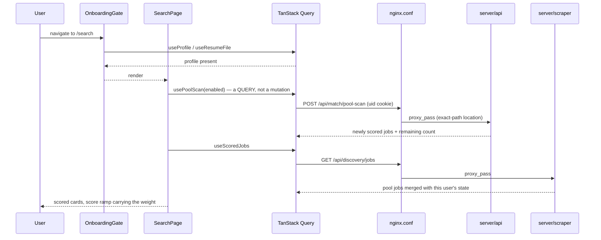

# Purpose & responsibilities

The client is the whole product surface: Matches, the Active board, Messages, Preparation, and the profile, in one dashboard. It is a React 19 SPA built with Vite, styled with Tailwind v4 and shadcn/ui under a dark-only editorial theme, and served in production by Nginx — which is not just a static file server here but the **reverse proxy that splits `/api/**` between the API and the scraper**, as an explicit path allowlist.

Its design brief is unusual and worth stating: NextRole is a scanning tool, not a reading surface. The match score carries the visual weight and typography stays quiet — two font weights, three type sizes, no gradients, no glow, tokens only. The client also owns the onboarding gate: with no profile, every page would show its own blank state, so all of them redirect to one upload call-to-action instead of five dead ends.

**Non-goals:** business logic or scoring (all server-side); calling Claude or holding any key; a light theme or theme toggle; server-state management by hand — TanStack Query owns every fetch.

## Public interfaces (contracts first)

**Routes** — [`src/main.tsx`](src/main.tsx), shell and nav in [`src/App.tsx`](src/App.tsx)

| Route | Page | Notes |
|---|---|---|
| `/` | `LandingPage` | Onboarding + CV upload CTA |
| `/search` | `SearchPage` | **Matches** — triggers the pool scan |
| `/score` | `ManualScorePage` | Paste a job description; works without a saved profile |
| `/active` | `ActivePage` | The Added → Ready → Applied → Interviewing board |
| `/tracker`, `/tracker/:id`, `/tracker/:id/pack` | `TrackerPage`, `ApplicationDetailPage`, `ResumePackPage` | Closed applications and full detail; kept reachable by URL after the "Apps" nav link was removed |
| `/messages` | `MessagesPage` | Mailbot-tracked mail |
| `/interview-prep`, `/practice-interview`, `/interview-insights` | prep, mock interview, retro insights | |
| `/settings` | `SettingsPage` | Profile editing |
| `/processing` | `ProcessingPage` | Post-upload beat; hands off to `/search` |
| `*` | `NotFoundPage` | |

Nav links appear only once a profile exists — `OnboardingGate` bounces every other path back to `/`, and advertising five dead ends would be worse than showing none. The gate **fails open** on a query error: only a confirmed, successfully-loaded empty profile redirects.

**Data access** — [`src/lib/api.ts`](src/lib/api.ts) wraps `fetch` with `credentials: 'include'` (so the `uid` cookie rides along even in a cross-origin deploy), a `/api` or `/api/match` base, and a 403 → "This action is disabled in the read-only demo." translation. `apiUrl()` builds a real href for cases that need one (a PDF `<a download>`). Read hooks live in [`src/lib/queries.ts`](src/lib/queries.ts), writes in [`src/lib/mutations.ts`](src/lib/mutations.ts).

**Reverse proxy** — [`nginx.conf`](nginx.conf). It is an **allowlist**: `/api/discovery/**` → scraper, named API paths → API, everything else → the SPA. A new browser-facing endpoint must be added here or it breaks in production while working fine in dev. The public config allowlists `/api/match` sub-paths individually rather than proxying the prefix — a prefix would also expose `title-triage`, `seniority-classify` and `discovery-score-batch`, scraper-internal AI routes with looser input caps, reachable with no auth on a real billed key.

**Events / CLI / jobs:** None beyond the package scripts.

## Invariants & rules

- **Never fire a mutation from a mount effect without a ref guard.** StrictMode runs effects twice in dev, and a `let cancelled` cleanup flag does not stop an awaited mutation — it only suppresses the `setState` after it, so the request still completes twice. This has bitten twice: a scan mutation that settled against the discarded mount and hung the spinner forever (fixed by making it a query), and the CV upload effect, which billed two Claude PDF reads and two profile saves per upload (`uploadedRef` in [`src/pages/ProcessingPage.tsx`](src/pages/ProcessingPage.tsx)). Guard with a ref keyed on the thing being acted upon, or prefer a query or an event handler. The single accepted exception is an idempotent write with no AI cost — `MessagesPage`'s mark-as-read — and it says so in a comment.
- **TanStack Query owns server state.** No `useEffect` + `useState` fetching.
- **Never hardcode a Tailwind palette color or a hex value.** Use `--ed-*` tokens inside editorial pages and shadcn semantic tokens in neutral or portaled chrome (nav, dialogs). Tokens: `--ed-paper`, `--ed-panel`, `--ed-ink`, `--ed-ink-soft`, `--ed-ink-faint`, `--ed-rule`, `--ed-rule-strong`, `--ed-accent`, `--ed-accent-deep`, `--ed-yes`, `--ed-no`, `--ed-gold`.
- **`--ed-accent` marks the primary action or the active/selected state, never decoration.** The score ramp is only ever for a 0–100 or rated score — never status, never category. Error and destructive states keep `--ed-no`; everything else that is neither a primary action nor a score stays neutral.
- **Dark is the only theme.** No light mode, no toggle.
- **Two font weights (400, 500) and three sizes (40 / 16 / 13).** The display face (`--font-serif`, Schibsted Grotesk) is for the wordmark and empty-state copy only; page titles and section headers are sans with weight.
- **Mostly flat.** The `.editorial` modern-skin layer already applies the soft elevation shadow to real bordered cards — do not hand-roll a heavier one. `.editorial-grain` / `.home-atmosphere` on Landing and Home are the only intentional ambient layers.
- **Mixed Hebrew content gets `dir="rtl"` / `dir="auto"` on those nodes** (AI summaries, interview text). The app is English LTR otherwise, and uses physical `pl-`/`pr-`/`ml-`/`mr-` spacing, not logical properties.
- **Tests query by text, role, and testid** — preserve those when restyling. An editorial restyle must keep heading roles (`AnalysisCard`'s "AI Analysis" stays an `<h3>`, asserted by an e2e `getByRole('heading')`).
- **Bun, not npm or yarn.**
- **Optimistic updates must survive a demo 403.** The `MessagesPage` mark-as-read loop is the cautionary tale: an optimistic flip, a 403, an `onError` refetch that reverts it, and an effect that fires the mutation again — an infinite flicker. That endpoint is allowlisted in the API for exactly this reason.

## Where things live

| Role | Path |
|---|---|
| Route table | [`src/main.tsx`](src/main.tsx) |
| App shell, nav, onboarding gate, scroll reset | [`src/App.tsx`](src/App.tsx) |
| Pages | [`src/pages`](src/pages) |
| Shared components | [`src/components`](src/components) |
| shadcn/ui primitives | [`src/components/ui`](src/components/ui) |
| fetch wrapper, query/mutation hooks, types | [`src/lib`](src/lib) |
| Theme tokens and the editorial layer | [`src/index.css`](src/index.css) |
| Test setup and render helper | [`src/test`](src/test) |
| Production image and proxy | [`Dockerfile`](Dockerfile), [`nginx.conf`](nginx.conf) |
| Dev server + proxy + vitest config | [`vite.config.js`](vite.config.js) |

## Control flow (core: opening Matches)



## Data & state

Owns no persistent data. All server state is TanStack Query cache, configured in [`src/lib/queryClient.ts`](src/lib/queryClient.ts); identity is the `uid` cookie, which the browser holds and the API issues. Local component state is ephemeral. There is no client-side persistence layer — no `localStorage` store of record.

## Configuration & flags

Build-time (Vite, baked into the bundle):

| Variable | Default | Purpose |
|---|---|---|
| `VITE_API_URL` | `""` (same origin) | Call the API directly, bypassing nginx |
| `VITE_SCRAPER_URL` | `""` (same origin) | Same, for the scraper |

Runtime (Nginx container, substituted by [`docker-entrypoint.d`](docker-entrypoint.d)):

| Variable | Purpose |
|---|---|
| `API_URL` | Upstream API for the proxy |
| `SCRAPER_URL` | Upstream scraper for the proxy |

**Runtime flag:** `GET /api/config` returns `demoMode`, surfaced through `useDemoMode()` so the UI can disable the controls that would write instead of letting them 403. Dev proxying is configured in [`vite.config.js`](vite.config.js) (`/api/discovery` and `/api/search` → :8000, `/api` → :5002). `vite.config.simulation.js` is a temporary parallel multi-user simulation stack on :5183 and is safe to delete.

## Dependencies

**Internal**
- `server/api` — everything except pool reads. *Failure modes:* 403 is rendered as the demo message; other errors surface through the query's error state.
- `server/scraper` — `/api/discovery/**` only (pool listing, save, dismiss, import).

**External:** none at runtime. React 19, React Router 7, TanStack Query 5, Radix primitives, `react-markdown` + `remark-gfm`, `lucide-react`, Tailwind v4 — all bundled.

## Observability & failure modes

- **Logs/metrics:** none client-side. No analytics, no error reporting service.
- **Failure modes worth recognising:**
  - a route that works in dev but fails in production (a POST answered `405`, falling through to the SPA's `try_files`) → it is missing from [`nginx.conf`](nginx.conf), which is an allowlist, not a prefix proxy
  - an endpoint 403ing on the demo instance → it needs an allowlist entry in the API's `Program.cs`, or it is correctly blocked
  - a spinner that never resolves after a StrictMode double-mount → a mutation fired from a mount effect; see the ref-guard rule
  - a Tailwind arbitrary value silently doing nothing → `calc()` needs whitespace around `+`/`-`, written as `_` in an arbitrary value; browsers drop the whole declaration otherwise
- **Dashboards:** the container is part of the set [`deploy/monitoring/check-services.sh`](../deploy/monitoring/check-services.sh) watches (`client`, `demo-client`).

## Performance & limits

A pool scan is a long request by design (roughly two rounds of concurrent batches for a capped 50-job scan), so the Matches page must tolerate a slow response rather than assume a fast one — nginx's `proxy_read_timeout` is raised for that location. The first-upload `/processing` screen is deliberately driven by real completion events, not a timer: three raymarched spheres fuse as the parse returns, the profile saves, and the first scores land — nothing can finish before the work does.

## How to change this

**Add a page**
1. Create it in [`src/pages`](src/pages) and register the route in [`src/main.tsx`](src/main.tsx).
2. Decide whether it belongs in `ONBOARDING_EXEMPT_PATHS` in [`src/App.tsx`](src/App.tsx) and whether it needs a `NAV_LINKS` entry (five is the current mobile tab-bar budget).
3. Read with a hook in `queries.ts`, write with one in `mutations.ts` — never fetch in an effect.
4. Style with `--ed-*` tokens; no hex, no palette colors, two weights, three sizes.
5. Add a `*.test.tsx` beside it querying by role/text/testid, and an `e2e/tests` spec for a user-visible flow.

**Call a new endpoint**
1. Add the hook in `queries.ts` / `mutations.ts` on top of `api()` / `matchApi()`.
2. **Add the path to [`nginx.conf`](nginx.conf)** — the config allowlists `/api/match` sub-paths one by one on purpose, so a scraper-internal AI route is never reachable unauthenticated; the dev proxy is a prefix match and will hide the omission.
3. If it mutates, check the API's demo allowlist and gate the control with `useDemoMode()` rather than letting it 403.

**Rollout/rollback:** a push to `main` under `client/**` triggers [`frontend.yml`](../.github/workflows/frontend.yml), which builds the image and recreates the `web` service.

## Testing

```bash
cd client && bunx vitest run          # unit / component (Vitest + Testing Library, jsdom)
cd e2e && npx playwright test --reporter=line
```

- Component tests sit beside their subject (`src/pages/*.test.tsx`, `src/components/*.test.tsx`); helpers in [`src/test/render.tsx`](src/test/render.tsx) and [`src/test/setup.ts`](src/test/setup.ts).
- [`src/lib/nginx-routes.test.ts`](src/lib/nginx-routes.test.ts) asserts that every `/api/match` path the client calls is allowlisted in `nginx.conf` — the guard against the "works in dev, breaks in prod" failure that shipped once as `HTTP 405` on the Matches tab (a POST falling through to the SPA's `try_files`).
- Fastest useful subset while restyling: `bunx vitest run src/components`.
- E2E setup, DB config, and conventions: [`e2e/IMPLEMENTATION.md`](../e2e/IMPLEMENTATION.md).

## Security

- **AuthZ boundary:** none in the client. The `uid` cookie is HttpOnly — JavaScript cannot read it, and the client never constructs or sends an identity of its own. Every authorization decision is the API's.
- **Validation hotspots:** rendered Markdown from AI output (`react-markdown`, no raw HTML plugin); user-supplied job descriptions and URLs, validated server-side; `dir` handling for mixed RTL content.
- **Secrets touched:** none. No key is ever present in the bundle — `VITE_*` values are public by construction and hold only URLs.
- **Headers:** Nginx adds `X-Content-Type-Options`, `X-Frame-Options`, `Referrer-Policy`, and a CSP. The private build additionally sits behind Basic Auth.
- **Demo:** controls that would write are disabled via `useDemoMode()`; the API's 403 is the real enforcement, and the UI state is the courtesy.

## Related links

- [`docs/design-system.md`](../docs/design-system.md) — theme tokens, page pattern, the portal caveat, RTL
- [`docs/tracker.md`](../docs/tracker.md) — list projection and the Applications tab buckets
- [`docs/scoring-and-search.md`](../docs/scoring-and-search.md) — what the Matches page is showing
- [`docs/demo-mode.md`](../docs/demo-mode.md) — which controls are disabled and why
- [`server/api/IMPLEMENTATION.md`](../server/api/IMPLEMENTATION.md) · [`server/scraper/IMPLEMENTATION.md`](../server/scraper/IMPLEMENTATION.md)
- [`OVERVIEW.md`](../OVERVIEW.md) · [`AGENTS.md`](../AGENTS.md) (note: its "Axios (not fetch)" rule predates the current code, which uses a `fetch` wrapper in `src/lib/api.ts`)
