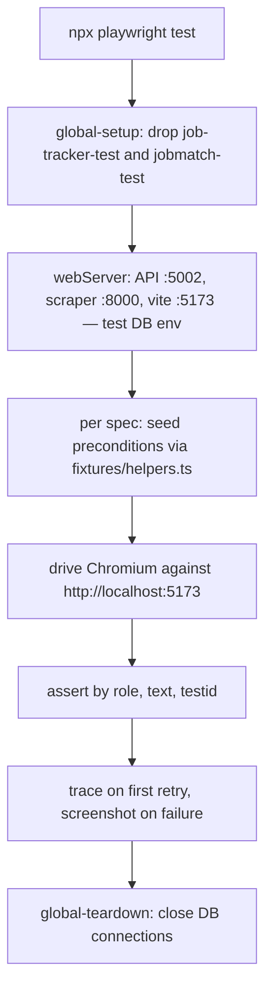

# Purpose & responsibilities

The end-to-end suite drives the real stack — the SPA in Chromium, the API, and the scraper — against disposable test databases, and asserts the flows a user actually performs: scoring a pasted job, working the tracker, opening an application's detail view, generating a résumé pack, and reading interview insights. It is the only test layer that exercises the three services together and the only one that would catch an integration seam the unit suites each consider someone else's problem.

It owns its own environment: `global-setup` drops `job-tracker-test` and `jobmatch-test` before the run, and Playwright's `webServer` config starts the API, the scraper, and Vite pointed at those databases. Tests seed directly through the Mongo driver via [`fixtures/helpers.ts`](fixtures/helpers.ts) rather than clicking their way to a precondition.

**Non-goals:** unit or component coverage (Vitest, in `client`); architecture guarantees (xUnit, in `server/api/tests`); load or performance testing; cross-browser coverage — Chromium only; testing against a deployed instance.

## Public interfaces (contracts first)

```bash
cd e2e && npx playwright test --reporter=line
```

`--reporter=line` matters: the default HTML reporter starts a report server that hangs the run at the end.

**Specs** — [`tests`](tests)
- [`manual-score.spec.ts`](tests/manual-score.spec.ts) — paste a job description, score it
- [`tracker.spec.ts`](tests/tracker.spec.ts) — the board and status transitions
- [`application-detail.spec.ts`](tests/application-detail.spec.ts) — detail view, notes, interviews, the `AI Analysis` heading role
- [`resume-pack.spec.ts`](tests/resume-pack.spec.ts) — Generate Pack
- [`interview-insights.spec.ts`](tests/interview-insights.spec.ts) — retro synthesis

**Fixtures** — [`fixtures/helpers.ts`](fixtures/helpers.ts): `getDb`, `closeDb`, `clearCollection`, `clearAll`, and typed inserters (`insertApplication`, `insertInterview`, `insertNote`, …) with sensible defaults and `Partial<>` overrides.

**Lifecycle** — [`global-setup.ts`](global-setup.ts) drops both test databases; [`global-teardown.ts`](global-teardown.ts) closes connections.

No HTTP surface, no events, no scheduled runs (this suite is not in CI's per-service deploy workflows).

## Invariants & rules

- **Stop your dev servers first.** `reuseExistingServer: !process.env.CI` means that if anything is already listening on :5002, :8000, or :5173, Playwright uses it — and then the suite runs against your **dev** databases instead of the disposable test ones, which `global-setup` drops. This is the single most expensive mistake available here.
- **A uvicorn `--reload` reloader can survive a task kill** and hold :8000 in *Bound* (not *Listen*) state. A `-State Listen` port check will not see it. Find and kill the python PID directly.
- **`global-setup` drops databases.** It only ever targets `job-tracker-test` and `jobmatch-test`, and the connection string comes from `e2e/.env.test` or the environment. Never point it at anything else.
- **Serial by design.** `fullyParallel: false`, `workers: 1` — the tests share one set of databases and one stack.
- **Seed through the driver, assert through the UI.** Preconditions are inserted with the helpers; assertions go through the page.
- **Tests query by text, role, and testid.** Restyling must preserve them — `AnalysisCard`'s "AI Analysis" stays an `<h3>` precisely because an e2e `getByRole('heading')` asserts it.
- **Use the `e2e-test-writer` agent to write new specs** — it carries the full setup, DB config, and conventions.
- **CI behaviour differs:** `forbidOnly`, one retry, and the `github` reporter when `CI` is set; no server reuse.

## Where things live

| Role | Path |
|---|---|
| Playwright config, ports, webServer stack | [`playwright.config.ts`](playwright.config.ts) |
| Database drop before the run | [`global-setup.ts`](global-setup.ts) |
| Teardown | [`global-teardown.ts`](global-teardown.ts) |
| Seed helpers and document types | [`fixtures/helpers.ts`](fixtures/helpers.ts) |
| Specs | [`tests`](tests) |
| Local connection string (untracked) | `.env.test` |
| Artifacts (ignore when reading the repo) | `playwright-report/`, `test-results/` |

## Control flow (core: one run)



## Data & state

- **Databases:** `job-tracker-test` and `jobmatch-test`, both dropped at the start of every run. The API is started with `MongoDB__DatabaseName=job-tracker-test` and both `MongoDB__Database` / `MongoDB__ProfileDatabase` set to `jobmatch-test`; the scraper with `MONGODB_DATABASE_NAME=job-tracker-test`.
- **Seeds:** per-spec, via the fixture helpers. No shared seed file.
- **Artifacts:** traces on first retry and screenshots on failure, under `test-results/`; the HTML report under `playwright-report/`. Both are build output.

## Configuration & flags

| Variable | Source | Purpose |
|---|---|---|
| `MongoDB__ConnectionString` | `e2e/.env.test`, else the environment | Cluster holding the test databases |
| `MONGODB_CONNECTION_STRING` | environment | Alternative spelling accepted by `global-setup` |
| `CI` | environment | Enables `forbidOnly`, one retry, the `github` reporter, and disables server reuse |

Ports are constants in [`playwright.config.ts`](playwright.config.ts): API 5002, scraper 8000, frontend 5173. If no connection string is found, `global-setup` warns and skips the drop rather than failing — so a run with stale data is possible; read the setup log line.

## Dependencies

**Internal:** `client`, `server/api`, `server/scraper` — all three are started by the config and must build. The API additionally needs a real `Anthropic__ApiKey` in the environment for any spec that exercises an AI path.

**External:** MongoDB Atlas (test databases) and Anthropic for AI-touching specs. *Failure modes:* a missing Anthropic key fails those specs at the API boundary; a missing Mongo string silently skips the database drop.

## Observability & failure modes

- **Output:** `--reporter=line` for a readable local run; `github` annotations in CI. Traces and screenshots on failure.
- **Signals worth recognising:**
  - a run that passes but leaves your dev data changed → server reuse; dev servers were up
  - `[global-setup] No MongoDB connection string found — skipping DB cleanup` → the run is against whatever was already in the test databases
  - the run appearing to hang after the last test → the HTML report server; use `--reporter=line`
  - port 8000 "free" but the scraper not restarting → a surviving uvicorn reloader in *Bound* state
- **Dashboards/alerts:** none. This suite is not wired into the deploy workflows.

## Performance & limits

Serial, one worker, one browser — wall-clock is the sum of the specs plus stack startup (30s API timeout, 15s scraper, Vite). AI-touching specs are the slow ones and spend real money on the configured key.

## How to change this

**Add a spec**
1. Create `tests/<feature>.spec.ts`. Prefer the `e2e-test-writer` agent — it already knows the setup and conventions.
2. Seed preconditions with [`fixtures/helpers.ts`](fixtures/helpers.ts); add a typed inserter there if the shape is new, mirroring the model in `server/api/src/Core/Models`.
3. Assert by role, text, or testid — never by class name or DOM shape, which the editorial restyles change freely.
4. Clean up with `clearCollection` / `clearAll` if the spec leaves state later specs would see.
5. Run with `--reporter=line`, with your dev servers stopped.

**Change ports or databases:** both are constants at the top of [`playwright.config.ts`](playwright.config.ts); change them together with `global-setup`'s `TEST_DBS`, or the drop and the run will disagree about which databases the suite owns.

## Testing

This component *is* a test suite. Its own correctness is checked by running it against a known-good commit, and by the fact that its assertions are stated in terms users recognise (headings, labels, visible text) rather than implementation details.

## Security

- **AuthZ boundary:** none. It runs against a locally started stack in `Fixed` identity mode.
- **Validation hotspots:** the `TEST_DBS` list in `global-setup` — this is the one place in the repo that drops databases by name.
- **Secrets touched:** `e2e/.env.test` holds a Mongo connection string and is untracked; a real `Anthropic__ApiKey` is needed in the environment for AI specs and is spent on every run that exercises them.
- **PII:** none — all data is generated by the fixtures.

## Related links

- [`AGENTS.md`](../AGENTS.md) — the testing section, including the dev-server and uvicorn gotchas
- [`client/IMPLEMENTATION.md`](../client/IMPLEMENTATION.md) — the UI these specs drive, and the query-by-role rule
- [`server/api/IMPLEMENTATION.md`](../server/api/IMPLEMENTATION.md) — the architecture suite that covers what this one cannot
- [`OVERVIEW.md`](../OVERVIEW.md)
