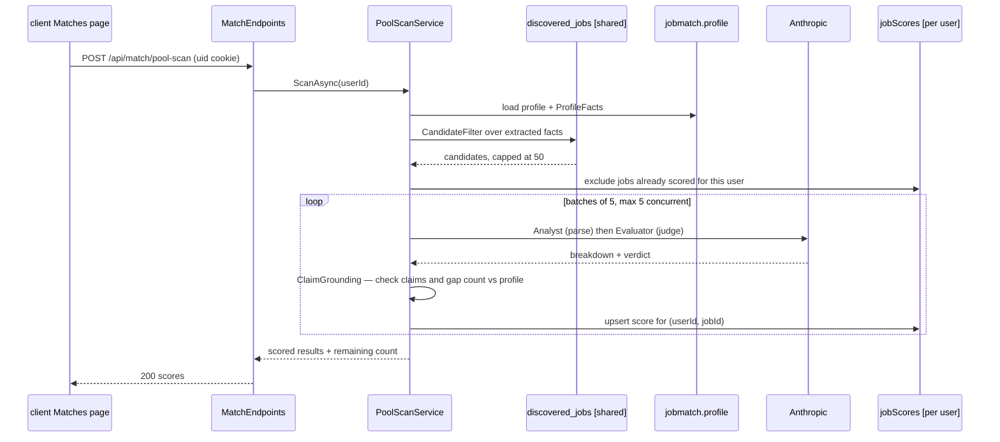

# Purpose & responsibilities

The API is the unified backend and **the only service in the repo that calls Claude**. It owns every piece of user data — the professional profile, the uploaded CV, per-user job scores, the application tracker and its children (interviews, notes, status history, résumé packs), tracked Gmail messages, mock-interview transcripts and interview insights — and it owns identity: it resolves every request to a `Guid` and is the sole issuer of the `uid` cookie. The scraper and the mailbot have no Anthropic key and no profile access; they call in over HTTP for triage, seniority classification, job-fact extraction, and email parsing. Keeping AI in one place keeps the key, the prompt bodies, the billing split, and the claim-grounding checks in one place too.

Its central job is the per-user half of the matching pipeline. Ingest produces a shared pool of postings with their stated requirements already extracted; this service decides what any one of those postings is *worth to one candidate*, on demand, and remembers the answer. Quality attributes it is built around, in order: **user isolation** (structural, since there is no auth layer behind it), **honesty about the model's output** (every claim about the candidate is checked against the profile server-side), and **bounded cost** (rate-limit buckets per workload, an atomic per-user pack quota, a hard cap on jobs scored per scan).

**Non-goals:** scraping or any direct job-board access (the scraper's job); authentication, sessions, or account recovery; a message bus or background worker fabric — everything is a synchronous HTTP request or a startup task; storing generated PDFs (packs render on demand and are never persisted as files).

## Public interfaces (contracts first)

OpenAPI is generated at runtime rather than checked in: `MapOpenApi()` + a Scalar UI, **Development only** ([`src/Api/Program.cs`](src/Api/Program.cs)). Route handlers live in [`src/Api/Endpoints`](src/Api/Endpoints); the rate-limit bucket each route joins is in parentheses.

**Matching & profile** — [`MatchEndpoints.cs`](src/Api/Endpoints/MatchEndpoints.cs)
- `POST /api/match` — score one pasted job description against the profile *(match)*
- `POST /api/match/pool-scan` — the Matches page: filter the shared pool, score what this user has never had scored *(discovery)*
- `POST /api/match/pool-scores` — read back stored scores for pool jobs *(discovery)*
- `POST /api/match/job-facts` — extract a posting's stated requirements; user-independent, called by the scraper *(discovery)*
- `POST /api/match/title-triage`, `POST /api/match/seniority-classify` — ingest-time AI gates, user-independent *(discovery)*
- `POST /api/match/discovery-score-batch` — legacy criteria-driven batch scoring *(discovery)*
- `POST /api/match/enrich-narrative` — live web enrichment (Glassdoor/news) for the manual path *(discovery)*
- `GET|PUT /api/match/profile`, `POST /api/match/profile/normalize`, `POST /api/match/profile/normalize-file` — the profile as user-editable input; the file route sends the PDF to Claude natively *(match)*
- `GET /api/match/profile/resume-file[/download]`, `GET|POST /api/match/profile/history/{field}[/restore]`
- `GET|PUT /api/match/interview-prep`, `.../history/{field}[/restore]`, `POST /api/match/interview-prep/cues` *(match)*

**Tracker** — [`ApplicationEndpoints.cs`](src/Api/Endpoints/ApplicationEndpoints.cs), [`InterviewEndpoints.cs`](src/Api/Endpoints/InterviewEndpoints.cs), [`NoteEndpoints.cs`](src/Api/Endpoints/NoteEndpoints.cs), [`StatsEndpoints.cs`](src/Api/Endpoints/StatsEndpoints.cs)
- `GET|POST /api/applications`, `GET /api/applications/{id}`, `DELETE /api/applications/{id}`, `GET /api/applications/exists`
- `PUT /api/applications/{id}/{status,salary,title,match-analysis}`
- `POST /api/applications/{id}/translate-analysis` and the `/company-summary/translate`, `/why-work-here/translate` siblings *(translate)*
- `POST /api/applications/{id}/company-summary`, `POST /api/applications/{id}/why-work-here` — **no rate-limit bucket and no cached short-circuit**, unlike their `/translate` siblings: both call Claude unconditionally on every request. Known gap, not a design choice.
- `POST /api/applications/{id}/interviews`, `PUT|DELETE /api/interviews/{id}`, `GET /api/interviews/upcoming`
- `POST /api/applications/{id}/notes`, `PUT|DELETE /api/notes/{id}`
- `GET /api/stats`, `GET /api/applications/{id}/timeline`

**Résumé packs** — [`ResumePackEndpoints.cs`](src/Api/Endpoints/ResumePackEndpoints.cs)
- `GET /api/applications/{id}/pack`, `POST .../pack` (generate, quota-claimed, *pack*), `PUT .../pack` (manual edit, no AI), `GET .../pack/pdf` (render on demand)

**Interview** — [`MockInterviewEndpoints.cs`](src/Api/Endpoints/MockInterviewEndpoints.cs), [`InterviewInsightsEndpoints.cs`](src/Api/Endpoints/InterviewInsightsEndpoints.cs)
- `POST /api/mock-interview/turn|debrief` *(mock)*, `GET|POST|DELETE /api/mock-interview/sessions[/{id}]`, `POST /api/mock-interview/adopt-rubric`
- `GET /api/interview-insights[/retros]`, `POST /api/interview-insights/synthesize` *(insights)*

**Messages & email** — [`MessageEndpoints.cs`](src/Api/Endpoints/MessageEndpoints.cs), [`EmailParseEndpoints.cs`](src/Api/Endpoints/EmailParseEndpoints.cs)
- `GET|POST /api/messages`, `GET /api/messages/gmail-ids`, `DELETE /api/messages/{id}`, `PATCH /api/messages/{id}/read`
- `POST /api/emails/parse` — the mailbot's Claude call *(discovery)*

**Unauthenticated / always open:** `GET /health`, `GET /api/config` (reveals only `demoMode`).

**Events produced/consumed:** None. **CLI/jobs:** None — see the sibling [Seeder](src/Seeder/IMPLEMENTATION.md) and [DbCopy](src/DbCopy/IMPLEMENTATION.md) CLIs.

## Invariants & rules

- **Every user-scoped query carries an explicit `userId`.** Repositories never receive an `IMongoCollection<T>`; they receive `UserScopedCollection<T>`, which has no overload that omits the userId, ANDs the filter internally, and exposes no way back to the raw handle. `ArchitectureTests` fails the build if any member hands one back. One-per-user documents use `_id = userId` instead, so there is no unscoped query shape to guard.
- **Uniqueness is per user.** `applications` is unique on `(UserId, Company, JobTitle)` with collation `en`/strength 2 (case-insensitive, accent-sensitive) — matching `ApplicationRepository.ExistsAsync`, so the index and the lookup agree. `messages` is unique on `(UserId, GmailMessageId)`; its upsert is a find-then-replace, i.e. a real check-then-act race without the index.
- **The shared pool is never user-scoped.** `discovered_jobs` and `pool_roles` are read unscoped by design; anything two users could disagree about lives in `jobScores` or `poolJobState`.
- **A claim about the candidate must trace to the profile.** `ClaimGrounding` recomputes, from the posting's extracted `must_have_tech` and the profile, both the unsupported-claim annotations on a score and the gap count that caps the technical dimension — never from the model's own self-report. `ResumePackValidator` applies the same idea to packs and **blocks** rather than annotates, because a pack goes to an employer.
- **Consequences never take model-authored input.** A check whose input the model writes is not a check.
- **Scan cost is bounded, not unlimited.** `PoolScanService.MaxCandidatesPerScan = 50`; batches of 5, at most 5 concurrent (one batch is an Analyst + Evaluator pair, ~80s measured — sequential batches outlive nginx's 60s `proxy_read_timeout`). "Only what is new" is the absence of a `jobScores` row, not a last-visited timestamp, so two concurrent tabs cannot double-charge.
- **Quotas are claimed, never counted afterwards.** `UserQuotaRepository` claims the pack allowance (3/user/day) atomically *before* the Claude call.
- **Startup ordering is load-bearing.** `UserScopeMigrationInitializer.MigrateOrThrowAsync` runs first and is **fatal** — per-user unique indexes cannot build while pre-multi-user documents lack a `UserId`, and an API that could not migrate would serve a view that does not match the database. Index creation follows and is best-effort but logs at error level.
- **Claude request shape for `claude-*-5` models.** `AnthropicThinkingHandler` stamps `thinking: adaptive` + `output_config: effort` on those requests and drops the explicit `temperature`. Without it they burn the whole `max_tokens` budget on thinking and return no text block at all.
- **Prompt separation.** Trusted instructions in the system prompt; untrusted external text XML-wrapped in the user message. Job descriptions capped at 50K chars.
- **Retries/timeouts.** The `anthropic` HttpClient has a 300s timeout with a retry policy ([`ServiceExtensions.cs`](src/Api/Extensions/ServiceExtensions.cs)); per-source keys (`Anthropic:ApiKeys:<source>`) are selected from the `X-Source` header so ingest can be billed separately.

## Where things live

| Role | Path |
|---|---|
| Route handlers | [`src/Api/Endpoints`](src/Api/Endpoints) |
| Host, middleware, rate limits, demo allowlist | [`src/Api/Program.cs`](src/Api/Program.cs) |
| DI wiring (repos, Claude, options) | [`src/Api/Extensions`](src/Api/Extensions) |
| Identity resolution & cookie issuance | [`src/Api/Identity`](src/Api/Identity) |
| Domain services (matching, scan, grounding) | [`src/Core/Matching`](src/Core/Matching) |
| Entities & validators | [`src/Core/Models`](src/Core/Models) |
| Profile model, renderer, scoring config | [`src/Core/Profile`](src/Core/Profile) |
| Repository interfaces | [`src/Core/Repositories`](src/Core/Repositories) |
| Claude client, prompt seeds, thinking handler | [`src/Infrastructure/AI`](src/Infrastructure/AI) |
| Mongo repositories, index & migration initializers | [`src/Infrastructure/Repositories`](src/Infrastructure/Repositories) |
| PDF rendering (QuestPDF) | [`src/Infrastructure/Pdf`](src/Infrastructure/Pdf) |
| Architecture tests | [`tests/ArchitectureTests`](tests/ArchitectureTests) |

## Control flow (core: a pool scan)

## Data & state

- **`job-tracker` DB:** `applications`, `interviews`, `notes`, `statusUpdates`, `messages`, `resumePacks`, `mockInterviewSessions`, `matchSnapshots`, `jobScores`, `userQuotas`, `interviewInsights`, `pool_roles`, plus the scraper-owned `discovered_jobs` (read as `BsonDocument`, since the scraper owns its schema).
- **`jobmatch` DB:** `profile`, `resumeFile`, `interviewPrep` — one document per user, `_id = userId`.
- **Indexes** ([`ApplicationIndexInitializer.cs`](src/Infrastructure/Repositories/ApplicationIndexInitializer.cs)): `uniq_user_company_jobtitle_ci` (unique, collated), `uniq_user_gmailmessageid` (unique), `idx_userid_applicationid` on interviews/notes/statusUpdates/resumePacks, `idx_userid` on applications/mockInterviewSessions/matchSnapshots, and `ttl_createdat_90d` on `matchSnapshots`. Legacy pre-multi-user indexes are dropped and duplicates cleared first, since a unique build fails otherwise.
- **Caching:** an in-process `IMemoryCache` fronts the profile provider. No Redis.
- **Migrations:** [`UserScopeMigrationInitializer.cs`](src/Infrastructure/Repositories/UserScopeMigrationInitializer.cs), run at startup, fatal on failure. Rehearse it against a copy with [DbCopy](src/DbCopy/IMPLEMENTATION.md).

## Configuration & flags

`__` in an env var maps to `:` in configuration. A local `.env` next to the content root is loaded if present. Defaults: [`src/Api/appsettings.json`](src/Api/appsettings.json).

| Key | Default | Purpose |
|---|---|---|
| `MongoDB__ConnectionString` | — (**required**) | Atlas connection string |
| `MongoDB__DatabaseName` | `job-tracker` | Tracking + shared pool DB |
| `MongoDB__ProfileDatabase` | `jobmatch` | Profile/scoring DB |
| `Anthropic__ApiKey` | — (**required**) | Claude key |
| `Anthropic__ApiKeys__<source>` | unset | Per-`X-Source` key (e.g. `ingest`) for separate billing; falls back to the default |
| `Identity__Mode` | `Fixed` | `Fixed` (single user) or `Cookie` (multi-user) |
| `Identity__FixedUserId` | sample GUID | The user in `Fixed` mode. **Set once per deployment** — changing it later needs a second migration |
| `Identity__CookieName` | `uid` | Cookie carrying the id in `Cookie` mode |
| `CorsOrigins` | `""` (none) | Comma-separated origins; `*` for dev (and then the uid cookie cannot ride along) |
| `ApiKey` | unset | Shared-secret gate — every request needs `X-Api-Key` except `/health` and `/api/config` |
| `DemoMode` | `false` | Read-only demo: mutating requests 403 unless allowlisted |
| `Scoring__*` | see appsettings | Models, temperatures, token budgets, `MinScoreToSave`, verdict bands |
| `Prompts__Analyzer` / `Prompts__Evaluator` | `PromptSeeds.cs` | Full prompt-text overrides |
| `Prompts__HebrewOutput__{WhyWorkHere,CompanySummary}` | `false` | The only two agents whose narrative may be Hebrew |

**Feature flags:** `DemoMode` and the two `HebrewOutput` toggles are the only ones. `scoring_config` and the prompts are **read-only server configuration** (Options pattern, env override, change = redeploy); the **profile is the user-editable input**, and its rendered `content` string is never hand-edited.

## Dependencies

**Internal**
- `client` — the browser caller; its nginx config is an explicit path allowlist, so a new browser-facing route must be added there too.
- `server/scraper` — calls in for triage, seniority, job facts, dedupe checks, and saving a discovered job. User-scoped calls must forward the `uid` cookie; the API mints a fresh user if they do not.
- `server/mailbot` — calls `POST /api/emails/parse` and the tracker write endpoints.

**External**
- **Anthropic Claude** — 300s timeout, retry policy, per-source keys. *Failure modes:* 429 → the caller's own backoff; an exhausted key stops scoring, ingest, and the mailbot together. *Fallback:* none — a failed call surfaces as an error, never as a fabricated score.
- **MongoDB Atlas** — *failure modes:* a connection failure at startup retries a few times and then brings the process down for the orchestrator to restart; at request time it surfaces as a 500.

## Observability & failure modes

- **Logs:** structured console logging, shipped by Promtail to Loki and read in Grafana ([`deploy/compose.yml`](../../deploy/compose.yml)). Startup logs the environment, whether Mongo is configured, the identity mode, and the legacy-owner id.
- **Loud failures worth knowing by shape:**
  - `INDEX ENSURE FAILED — continuing startup WITHOUT the per-user unique indexes` — application and message dedupe have silently reverted to check-then-act; duplicates will accumulate. Fix and restart.
  - A crash loop right after `=== ApplicationTracker starting ===` is usually the fatal user-scope migration.
  - An empty Claude completion on a `claude-*-5` model means `AnthropicThinkingHandler` is not on the request path.
  - `403 {"error":"This is a read-only demo."}` on a new endpoint means it needs an allowlist entry in `Program.cs`.
- **Metrics / traces:** none.
- **Triage tips:** after a restart, confirm the process actually runs the new code — hit the endpoint with `{}`; a **404** where a **400** is expected means the old build is still serving.

## Performance & limits

- One pool-scan batch (Analyst + Evaluator over 5 jobs) measured at ~80s; 5 batches run concurrently so a capped 50-job scan is roughly two rounds. Sequential batching would exceed nginx's 60s `proxy_read_timeout`.
- Measured cost: about **$0.011 per scored job**, so a full 50-job scan is about **$0.57**. Job-fact extraction at ingest is about **$0.002 a job**.
- Rate-limit buckets are sized by workload, not uniformly: `match` 10/min (interactive), `discovery` 20/min (batch, kept separate so a scan never starves the manual page), `mock` 40/min (conversational), `insights`/`pack`/`translate` 10/min.

## How to change this

**Add an endpoint**
1. Add the route in the matching `src/Api/Endpoints/*.cs`, taking `IUserContext` and passing the `Guid` down.
2. Put logic in `src/Core/**` and data access behind an `I*Repository` in `src/Core/Repositories`, implemented in `src/Infrastructure/Repositories` over `UserScopedCollection<T>` — never a raw collection.
3. Register it in [`ServiceExtensions.cs`](src/Api/Extensions/ServiceExtensions.cs) (and `MongoExtensions.cs` if it needs a new collection).
4. Attach a rate-limit bucket with `.RequireRateLimiting(...)` if it calls Claude.
5. If it mutates and must work in demo, add it to the `DemoMode` allowlist in `Program.cs` — otherwise confirm it *should* 403.
6. Add the path to [`client/nginx.conf`](../../client/nginx.conf) if the browser calls it; that file is an allowlist, not a catch-all.
7. Tests: extend `tests/ArchitectureTests` for any new repository, and `e2e/tests` for a user-visible flow.

**Add or change a prompt rule**
1. Edit the seed in [`PromptSeeds.cs`](src/Infrastructure/AI/PromptSeeds.cs).
2. Add the code check with it — a rule with nothing enforcing it is not a rule. Grounding-style checks belong in `ClaimGrounding` / `ResumePackValidator`, computed from data the model does not author.
3. If it cannot be checked, record that in the code and say why.
4. Cover it in `ArchitectureTests` (see `ClaimGroundingTests.cs`) and measure against real output before making it block.

**Rollout/rollback:** push to `main` under `server/api/**` triggers [`.github/workflows/api.yml`](../../.github/workflows/api.yml), which deploys both `api` and `demo-api`. Rollback is a redeploy of the previous image tag from GHCR.

## Testing

- **Architecture (xUnit):** `dotnet test server/api/tests/ArchitectureTests -c Release` — user-scoping (`UserScopingTests`, `RawCollectionAccessTests`), claim grounding (`ClaimGroundingTests`), role canonicalization. Use `-c Release` if a dev server holds the Debug output lock. This suite *is* the multi-user guarantee.
- **E2E (Playwright):** [`e2e/tests`](../../e2e/tests) covers the API through the UI. Stop dev servers first — see [`e2e/IMPLEMENTATION.md`](../../e2e/IMPLEMENTATION.md).
- **Fixtures/seeds:** `Data/sample-profile.json` and the [Seeder](src/Seeder/IMPLEMENTATION.md).
- **No unit-test project** for `Core` beyond the architecture suite.

## Security

- **AuthZ boundary:** `IdentityResolver` + `HttpUserContext` produce the `Guid`; everything downstream is scoped by it. `UserScopedCollection` makes a missed filter a compile error. The optional `ApiKey` gate is a hosting control, not per-user auth.
- **Validation hotspots:** 50K-char cap on job descriptions; PDF upload size and page count (`PdfPageCounter`); `Guid` route constraints on every id; enum values parsed from strings.
- **Secrets touched:** `Anthropic__ApiKey` (+ per-source keys), `MongoDB__ConnectionString`, `ApiKey`. Read from environment only; never logged.
- **PII / multi-tenant:** holds the CV, the derived profile, and Gmail bodies. Tenancy is by `uid` cookie with no authentication behind it — which is exactly why the scoping rules above are structural.
- **Untrusted input:** scraped titles, job descriptions, and email bodies are XML-wrapped in the user message, never placed in the system prompt; model output naming the candidate's technologies is verified before it is shown or shipped.

## Related links

- [`docs/scoring-and-search.md`](../../docs/scoring-and-search.md) — scoring pipeline, dimensions, verdict bands, claim grounding
- [`docs/multi-user.md`](../../docs/multi-user.md) — identity modes, scoping, migration
- [`docs/resume-pack.md`](../../docs/resume-pack.md) · [`docs/tracker.md`](../../docs/tracker.md) · [`docs/interview-prep.md`](../../docs/interview-prep.md)
- [`docs/demo-mode.md`](../../docs/demo-mode.md) · [`docs/hosting-a-public-demo.md`](../../docs/hosting-a-public-demo.md)
- [`AGENTS.md`](../../AGENTS.md) — hard conventions · [`OVERVIEW.md`](../../OVERVIEW.md) — repo index
- [`deploy/README.md`](../../deploy/README.md) — deployment and the `Identity:FixedUserId` caveat
