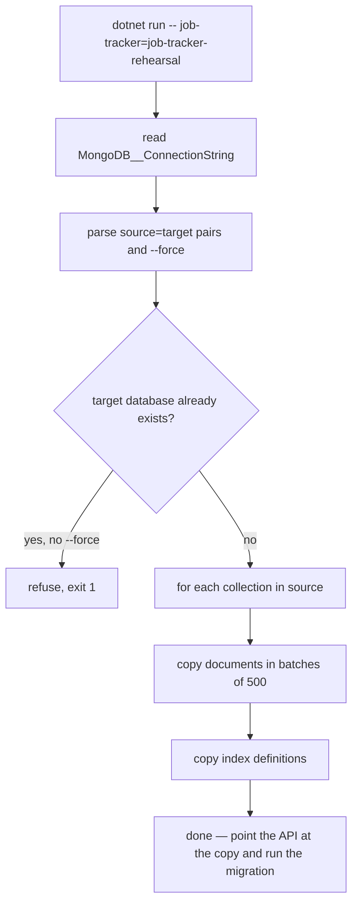

# Purpose & responsibilities

A single-file console tool that copies a MongoDB database — **documents and index definitions** — to a new name. It exists for one reason: to make the multi-user migration rehearsable against real data before it runs for real. The index definitions are the point. The migration drops and rebuilds the legacy unique indexes and the retention TTL, so a document-only copy silently skips half of what is being rehearsed and a clean rehearsal proves nothing.

It is read-only on every source and refuses to write into a database that already exists. A "scratch" name that turns out to be a real database is how live data gets clobbered, and this tool is deliberately not the thing that assumes.

**Non-goals:** backup or restore, incremental sync, cross-cluster copying, filtering or transforming documents, running unattended.

## Public interfaces (contracts first)

```bash
MongoDB__ConnectionString="<uri>" dotnet run --project server/api/src/DbCopy -- \
    job-tracker=job-tracker-rehearsal jobmatch=jobmatch-rehearsal
```

- **Arguments:** one or more `source=target` pairs; both sides required and non-empty. A malformed pair exits 1 with the offending argument.
- **`--force`:** proceed even though a target database already exists. Without it, an existing target is refused.
- **Exit codes:** `0` success, `1` bad arguments, missing connection string, or a refused target.

No HTTP surface, no events, no scheduled invocation.

## Invariants & rules

- **Read-only on every source.** Nothing is written to, dropped from, or re-indexed on a source database.
- **Refuses an existing target unless `--force`.** This is the tool's main safety property; treat `--force` as a statement that you have checked what is in the target.
- **Indexes are copied, not just documents.** Copying documents alone would produce a rehearsal that cannot fail the way the real migration can.
- **Batched writes** at `BatchSize = 500`, so a large collection does not build one enormous request.
- **Same cluster, same credentials.** It takes one connection string and copies within it — there is no source/target credential split.
- **It is not a backup.** A copy is a point-in-time snapshot taken without a consistent read across collections; use it for rehearsal, not recovery.

## Where things live

| Role | Path |
|---|---|
| The entire tool | [`Program.cs`](Program.cs) |
| The migration it exists to rehearse | [`../Infrastructure/Repositories/UserScopeMigrationInitializer.cs`](../Infrastructure/Repositories/UserScopeMigrationInitializer.cs) |
| Index definitions it must faithfully carry | [`../Infrastructure/Repositories/ApplicationIndexInitializer.cs`](../Infrastructure/Repositories/ApplicationIndexInitializer.cs) |

## Control flow (core: a rehearsal copy)



## Data & state

Owns nothing. It reads whatever collections the source databases hold and writes an identically named set into the targets, then exits. No local state, no cache, no TTL of its own — though any TTL index in the source is reproduced in the target, which is exactly what makes the rehearsal meaningful.

## Configuration & flags

| Variable | Default | Purpose |
|---|---|---|
| `MongoDB__ConnectionString` (or `MongoDB:ConnectionString`) | — (**required**) | Cluster holding both source and target |

| Flag | Purpose |
|---|---|
| `--force` | Write into a target database that already exists |

No feature flags, no appsettings file.

## Dependencies

**Internal:** none — it references only the MongoDB driver, deliberately, so it stays runnable when the API does not build.

**External:** MongoDB Atlas. *Failure modes:* a missing connection string exits 1 before any connection; a mid-copy failure leaves a partial target, which is safe to drop and retry since the target is a scratch name by construction.

## Observability & failure modes

Console output only: per-database and per-collection progress, and an explicit refusal message naming the target when one already exists. No metrics, logs shipping, or alerts. The failure this tool is built to prevent — writing into a real database — surfaces as a refusal, not as a stack trace.

## Performance & limits

Bounded by document count and network round-trips at 500 documents per batch. A personal-scale database copies in minutes. There is no parallelism across collections and no resume-from-partial.

## How to change this

**Rehearse a migration**
1. Pick target names that are obviously scratch, and confirm they do not exist.
2. Run the copy for both databases in one invocation (`job-tracker=…` and `jobmatch=…`) — the migration spans both.
3. Point a local API at the copies (`MongoDB__DatabaseName`, `MongoDB__ProfileDatabase`) with the intended `Identity__Mode` and `Identity__FixedUserId`.
4. Start the API and watch startup: the user-scope migration is fatal on failure, so a clean start *is* the rehearsal passing.
5. Verify the rebuilt indexes exist with the expected shape, not just the expected name.
6. Drop the scratch databases when done.

**Change the tool itself:** keep the refuse-existing-target guard and the index copy; both are the reason it exists. Any new flag that relaxes a safety check should be as loud as `--force`.

## Testing

None automated. It is exercised by use: copy into a scratch name, run the migration against the copy, confirm the indexes. Its own safety behaviour is worth checking directly — run it once against an existing target and confirm it refuses.

## Security

- **AuthZ boundary:** none. It has whatever the connection string grants, on both sides.
- **Validation hotspots:** argument parsing (`source=target`, both non-empty) and the target-exists check.
- **Secrets touched:** `MongoDB__ConnectionString` only; never logged.
- **PII:** a copy contains everything the source contains — profiles, CVs, email bodies. A rehearsal database is as sensitive as production data and should be dropped when the rehearsal ends.

## Related links

- [`deploy/README.md`](../../../../deploy/README.md) — the deployment runbook, including the `Identity:FixedUserId` one-way setting
- [`docs/multi-user.md`](../../../../docs/multi-user.md) — the migration this rehearses
- [`server/api/IMPLEMENTATION.md`](../../IMPLEMENTATION.md) — startup ordering and index guarantees
- [`server/api/src/Seeder/IMPLEMENTATION.md`](../Seeder/IMPLEMENTATION.md) — the sibling CLI
- [`OVERVIEW.md`](../../../../OVERVIEW.md)
