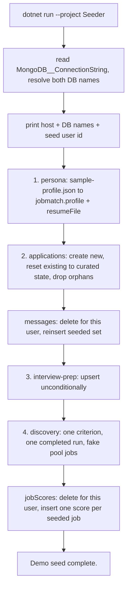

# Purpose & responsibilities

A one-shot console app that fills a **demo** database with fictional data: the sample persona profile and its résumé file, a set of invented applications across varied statuses with their interviews, status history and notes, seeded Gmail-style messages, an interview-prep document, and a fake discovery pool with per-user job scores already attached. It exists so `DemoMode=true` has something coherent to show — a public instance where every write is blocked still needs a board worth looking at.

It is designed to be re-run. Applications already present by company + title are reset to their curated state rather than duplicated, messages and the seeded pool are cleared and rewritten, and the interview-prep document is synced unconditionally — which is what makes a demo visitor's edits (or vandalism) survivable: the next reseed undoes them.

**Non-goals:** seeding a real user's data; running against a production database; generating anything from a real CV or a real posting; running as a service.

## Public interfaces (contracts first)

```bash
MongoDB__ConnectionString="<demo-db-uri>" dotnet run --project server/api/src/Seeder
```

No arguments, no HTTP surface, no events. It prints what it is about to do — host, tracker database, profile database, and the user id it is seeding as — before it writes anything, and a per-section summary as it goes (`Applications: N created, N reset to curated state, …`).

## Invariants & rules

- **It seeds exactly one user.** There is no anonymous or shared demo reader: whoever owns this data reaches it with that id. The id comes from `Identity__FixedUserId` when set, else `UserIds.OrphanedLegacyData` — mirroring `IdentityResolver.LegacyOwnerUserId`, so pointing the seeder at a `Fixed`-mode instance seeds *that instance's* user rather than a second orphaned one.
- **Idempotent by curation, not by skipping.** Applications matched on company + title are reset to their curated state; demo-added orphans (children whose application no longer exists) are deleted; messages and seeded pool rows are cleared and reinserted.
- **Point it at a demo database, never a real one.** It deletes and reinserts per seed user, so the blast radius is bounded by nothing except which database it was given. **Confirm the target name is free or is genuinely the demo database first** — `list_database_names()` before seeding into a scratch name is the standing rule after two documents were once written into the real demo DB, caught only because a legacy unique index happened to abort the run.
- **Fictional data only.** Invented companies, a hardcoded fake identity for the persona (name, email, phone), and job descriptions that describe nobody.
- **`sample-profile.json` is the single source of truth for the persona** ([`../../Data/sample-profile.json`](../../Data/sample-profile.json)); the seeder renders it through the same `MongoProfileProvider` the API uses, so the demo profile is shaped exactly like a real one.
- **Status is not currently reset.** The seeder skips applications that already exist by company + title, so a demo visitor's allowed `Withdrawn` transition is not undone by the next reseed. That is a known follow-up, noted in the API's demo allowlist comments.

## Where things live

| Role | Path |
|---|---|
| The entire seeder | [`Program.cs`](Program.cs) |
| Persona source data | [`../../Data/sample-profile.json`](../../Data/sample-profile.json) |
| Profile persistence and rendering | [`../Infrastructure/Profile/MongoProfileProvider.cs`](../Infrastructure/Profile/MongoProfileProvider.cs) |
| Résumé PDF fonts (registered at startup) | [`../Infrastructure/Pdf`](../Infrastructure/Pdf) |

## Control flow (core: a seed run)



## Data & state

Writes into both databases as the seed user: `jobmatch` — `profile`, `resumeFile`, `interviewPrep`; `job-tracker` — `applications`, `interviews`, `statusUpdates`, `notes`, `resumePacks`, `messages`, `jobScores`, plus `search_criteria`, `discovery_runs`, and `discovered_jobs` rows tagged with the seeded `criteria_id` so a reseed can clear precisely those. Owns no collection of its own and creates no index — the API's initializers do that on startup.

The API additionally runs `DemoJobFreshnessInitializer` at startup when `DemoMode=true`, nudging the seeded pool rows back inside the Matches page's default 14-day window so a restart does not require a manual reseed.

## Configuration & flags

| Variable | Default | Purpose |
|---|---|---|
| `MongoDB__ConnectionString` | — (**required**) | The **demo** database URI |
| `MongoDB__DatabaseName` | `job-tracker` | Tracking DB |
| `MongoDB__ProfileDatabase` (or `MongoDB__Database`) | `jobmatch` | Profile DB |
| `Identity__FixedUserId` | `UserIds.OrphanedLegacyData` | The user everything is seeded under |

Both `__` and `:` spellings are accepted. No feature flags.

## Dependencies

**Internal:** `ApplicationTracker.Core` (models, profile types) and `ApplicationTracker.Infrastructure` (Mongo repositories, `MongoProfileProvider`, QuestPDF font registration). It shares the API's persistence code on purpose — seeded data must be indistinguishable in shape from real data.

**External:** MongoDB Atlas. *Failure modes:* a bad connection string exits 1 with a message; a mid-run failure leaves a partial seed, which is safe to fix by re-running. A least-privilege DB user is recommended — see [`docs/hosting.md`](../../../../docs/hosting.md).

## Observability & failure modes

Console output only, and it is the interface: the first two lines name the host, both databases, and the seed user, so a wrong target is visible *before* the writes. Per-section counts follow. There are no metrics, traces, or alerts. The failure worth guarding against is not a crash — it is a successful run against the wrong database.

## Performance & limits

Seconds. A few hundred documents at most, dominated by connection setup.

## How to change this

**Add or edit seeded content**
1. Persona changes go in [`sample-profile.json`](../../Data/sample-profile.json), not in code.
2. Applications, messages, prep, and pool jobs are literal data in [`Program.cs`](Program.cs), grouped under the numbered section comments (`1) Persona`, `2) Fictional applications`, `3) Interview-prep`, `4) Discovery`).
3. Keep every company and person fictional.
4. Preserve the reset-rather-than-duplicate behaviour: match on company + title, and clear-then-reinsert for the collections that do that today.
5. If the new content backs a demo-visible action that writes, check the API's `DemoMode` allowlist in [`../Api/Program.cs`](../Api/Program.cs) — an allowed write should be self-healing on the next reseed, and if it is not, say so where the exception is granted.

**Rollout:** run manually against the demo database after deploying; it is safe to re-run any time.

## Testing

No automated tests. Verification is the run itself: point it at a scratch database, read the printed summary, and open the demo instance. **Confirm the target database name before running** — that check is the test.

## Security

- **AuthZ boundary:** none. It connects directly to Mongo with whatever the connection string grants, which is why a least-privilege demo user is the documented practice.
- **Validation hotspots:** none — all input is literal in-repo data.
- **Secrets touched:** `MongoDB__ConnectionString` only. **Never set `ApiKey` on the demo instance**, and never point this tool at the private database.
- **PII:** none. The persona's identity is hardcoded and fake.

## Related links

- [`docs/hosting.md`](../../../../docs/hosting.md) — least-privilege database credentials
- [`server/api/IMPLEMENTATION.md`](../../IMPLEMENTATION.md) — the allowlist middleware this data is shown behind
- [`server/api/src/DbCopy/IMPLEMENTATION.md`](../DbCopy/IMPLEMENTATION.md) — the sibling CLI, for rehearsing migrations
- [`OVERVIEW.md`](../../../../OVERVIEW.md)
