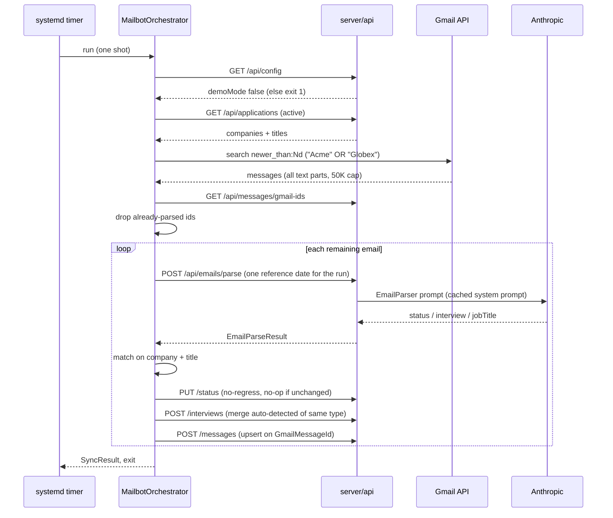

# Purpose & responsibilities

The mailbot keeps the application tracker current without anyone touching it. It is a **one-shot console process, not a service**: a cron invocation pulls the active applications from the API, searches Gmail for recent mail from exactly those companies, has the API parse each message with Claude, and applies the resulting status and interview updates. It exits when it is done. Everything it knows about which mailboxes matter comes from the board — the tracker is its input, and a company that is not on the board is never searched for.

It holds no Anthropic key and no database connection. Parsing is `POST /api/emails/parse`; every write is an API call. Its quality attributes are **idempotency** (the lookback window overlaps by design, and re-processing the same email must change nothing and cost nothing), **never regressing an application** (an email can only move a role forward), and **never guessing** — a missing interview date or end time stays missing rather than being inferred from the run clock.

**Non-goals:** managing Gmail labels or filters (deleted — search is retroactive, so a company added today is covered across the whole window immediately, and `gmail.readonly` is the only scope needed); sending or replying to mail; scoring; reading a profile; running continuously.

## Public interfaces (contracts first)

No inbound interface. It is invoked, it runs, it exits.

**CLI / modes** — [`Program.cs`](Program.cs)
- *(no args)* — **daily sync**: recent mail within `Gmail:LookbackDays`, matched against tracked companies
- `resync --company "X" [--title "Y"]` — **per-application re-sync**: the company's *full* mail history, oldest→newest, reconcile-only. Equivalent env form: `Mailbot__Resync=true` (+ optional `Mailbot__ResyncCompany` / `Mailbot__ResyncTitle`; company unset ⇒ all applications)

**Outbound calls into the API** — [`TrackerApiClient.cs`](Services/TrackerApiClient.cs), every request carrying `X-Source: mailbot`
- `GET /api/config` — abort with exit 1 if `demoMode: true`
- `GET /api/applications` — the active board, and the company list the Gmail query is built from
- `GET /api/messages/gmail-ids` — already-parsed message ids, to skip re-billing the overlap
- `POST /api/emails/parse` — the Claude call
- `PUT /api/applications/{id}/status`, `POST /api/applications/{id}/interviews`, `POST /api/messages`

**Scheduled:** [`deploy/systemd/nextrole-mailbot.timer`](../../deploy/systemd/nextrole-mailbot.timer) at 02:00 UTC; [`crontab`](crontab) is the container-internal equivalent.

**Events produced/consumed:** None.

## Invariants & rules

- **It refuses to run against a demo instance.** `GET /api/config` first; `demoMode: true` → exit 1. `POST /api/messages` is deliberately *not* on the API's demo allowlist either — defense in depth.
- **It requires a `Fixed`-mode API.** It sends no `uid` cookie, so identity comes from `Identity:FixedUserId` on the instance it points at. Pointing it at a Cookie-mode API would file writes under a freshly minted user.
- **No regress.** `MailbotOrchestrator.SetStatusAsync` will not move an application to an earlier-stage status. `PUT .../status` is additionally a no-op when the status is unchanged, so re-processing never appends duplicate timeline rows.
- **Interview merge, not duplicate.** The create-interview endpoint updates the existing *auto-detected* interview of the same type (scoped to `Notes == "Auto-detected from email"`), carrying `EndsAt` / `Interviewer` / `Topics` forward. Manual interviews are never merged.
- **Messages are upserted on Gmail's own id.** `(UserId, GmailMessageId)` is unique in the API, so the overlapping window and the full-history re-sync both stay idempotent. An email the parser recognized but could not tie to an application is still persisted with `ApplicationId: null` and flagged in the client — a bad match is visible instead of invisible.
- **Already-parsed mail is skipped before it is billed.** The id lookup is best-effort: if it fails, everything is processed rather than risking a missed update. DB writes are free by idempotency; the Claude call is not.
- **Times are wall-clock in `Mailbot:TimeZone`** (IANA, default `Asia/Jerusalem`) and converted to UTC in `CombineDateAndTime`. An unresolvable zone is **fatal** — the old fallback to `TimeZoneInfo.Local` made the conversion a no-op inside the UTC container and stored every interview three hours off. `Dockerfile` installs `tzdata` for this reason.
- **Nothing is inferred.** No date found → date only, no run-clock time. `interviewEndTime` is set only when the email states a range.
- **One reference date per run.** The whole run shares a fixed reference date so every email gets a byte-identical system prompt and the prompt cache actually hits.
- **Matching is company + title.** Exact → substring → token overlap, falling back to the first company match with a logged warning. Company names are matched on `CoreCompany` — a trailing `" - <location>"` is stripped — so `--company "Applied Materials"` resolves the stored `"Applied Materials - Israel"`.
- **Body extraction concatenates all text parts** (every `text/plain` plus HTML-stripped `text/html`, capped at 50K chars), because dates and interviewer names often live inside an ATS or calendar HTML card rather than the first part.
- **It skips cleanly with no credentials.** No `Gmail:CredentialsPath` → exit without error, so a deployment without Gmail configured is not a failing cron job.

## Where things live

| Role | Path |
|---|---|
| Entry point, DI, mode selection, `.env` loading | [`Program.cs`](Program.cs) |
| The whole sync flow, matching, idempotency, timezone | [`Services/MailbotOrchestrator.cs`](Services/MailbotOrchestrator.cs) |
| Gmail auth, search, message parsing, body extraction | [`Services/GmailEmailService.cs`](Services/GmailEmailService.cs) |
| API client + retry/backoff | [`Services/TrackerApiClient.cs`](Services/TrackerApiClient.cs) |
| Claude parsing via the API | [`Services/HttpEmailParser.cs`](Services/HttpEmailParser.cs) |
| DTOs | [`Models`](Models) |
| Schedule (container-internal) | [`crontab`](crontab) |

## Control flow (core: the daily sync)



## Data & state

Owns no collection. It writes through the API into `applications`, `statusUpdates`, `interviews`, and `messages`; `(UserId, GmailMessageId)` uniqueness on `messages` is what makes re-processing safe. The only local state is the Google OAuth token cache (`%APPDATA%\Google.Apis.Auth\…TokenResponse-user` locally; a mounted file in the container).

## Configuration & flags

`__` maps to `:`. A local `.env` in the working directory or next to the executable is loaded if present.

| Variable | Default | Purpose |
|---|---|---|
| `Tracker__BaseUrl` | `http://localhost:5002` | The API it reads from and writes to |
| `Tracker__ApiKey` | unset | Sent as `X-Api-Key` when the target API has its own gate |
| `Gmail__CredentialsPath` | unset | OAuth client-secrets JSON. **Absent ⇒ skip and exit cleanly** |
| `Gmail__LookbackDays` | `3` | Daily-sync window, deliberately overlapping to cover a missed run |
| `Gmail__Query` | built from tracked companies | Verbatim override of the search query |
| `Mailbot__TimeZone` | `Asia/Jerusalem` | IANA zone the email wall-clock times are written in. Fatal if unavailable |
| `Mailbot__Resync` | `false` | Full-history reconcile instead of the daily sync |
| `Mailbot__ResyncCompany` / `Mailbot__ResyncTitle` | unset | Scope the re-sync; company unset ⇒ all applications |

No feature flags. It needs **no** Anthropic key and **no** Mongo connection string.

## Dependencies

**Internal**
- `server/api` — parsing and every write. *Failure modes:* 403 means it is pointed at a demo instance (it should have aborted earlier); 401 means `Tracker__ApiKey` is missing or wrong; transport errors are retried with backoff, and a failed `POST /api/messages` is swallowed and logged so message persistence never blocks a tracker update.

**External**
- **Gmail API** (`gmail.readonly`) — *failure modes:* `invalid_grant: Token has been expired or revoked`. Refresh tokens issued while the OAuth consent screen is in *Testing* expire after 7 days; the app is published, so this should not recur. Recovery: delete the token cache, run locally to re-consent, and replace the token file mounted into the container.
- **Google OAuth** — the token cache is the only credential state on disk.

## Observability & failure modes

- **Logs:** console, captured by the container runtime (and `/var/log/mailbot.log` under the internal crontab). The run prints how many applications, emails, and updates it handled.
- **Signals worth recognising:**
  - immediate `exit 1` after startup → the tracker reported `demoMode: true`
  - clean exit with no work → no `Gmail__CredentialsPath` configured
  - `TimeZoneNotFoundException` on `Mailbot:TimeZone` → the image lacks IANA zone data; this is fatal on purpose, because the alternative was silently storing every interview in the wrong zone
  - interviews landing at the wrong hour → check `Mailbot__TimeZone` before suspecting the parser
  - a "matched by company, title ambiguous" warning → several applications share a company and the parser's `jobTitle` did not disambiguate
- **Alerts / dashboards:** none dedicated. The mailbot is a `cron`-profile Compose service and is not part of the always-running set `check-services.sh` watches.

## Performance & limits

One run is bounded by the number of tracked companies and the lookback window; the dominant cost is one Claude call per *not-yet-seen* email, which is why the id-skip exists and why the window is kept as tight as the missed-run margin allows. The HTTP client timeout is 120s. Email bodies are capped at 50K chars.

## How to change this

**Change a parsing rule (e.g. how an interview type maps to a status)**
1. The prompt lives in the API (`PromptSeeds.EmailParser`), not here — edit it there.
2. Map the parsed result in [`MailbotOrchestrator.cs`](Services/MailbotOrchestrator.cs) (`interviewType` → status: `Phone`/`HR` → PhoneScreen, `Technical` → TechnicalInterview, `Final` → FinalRound).
3. Keep the no-regress guard and the auto-detected-merge scope intact — both are what make re-runs safe.
4. Verify with `resync --company "X"` against a **non-demo** instance; it is reconcile-only and writes only on change.

**Add a field carried from an email onto an application**
1. Extend `EmailParseResult` in the API and the mailbot's `Models/EmailUpdate.cs`.
2. Apply it in the orchestrator, and make the apply idempotent — an unchanged value must write nothing.
3. Add the corresponding API endpoint or extend an existing one; allowlist it in `Program.cs` only if it should work in demo (for mailbot writes, it should not).

**Rollout/rollback:** a push to `main` under `server/mailbot/**` triggers [`.github/workflows/mailbot.yml`](../../.github/workflows/mailbot.yml), deploying the cron-profile service.

## Testing

No automated test project. Verification is manual and safe by construction:

```bash
# Dry-ish run against a real non-demo tracker; reconcile-only, writes only on change
dotnet run --project server/mailbot -- resync --company "Some Company" --title "Some Role"
```

Idempotency is the property to check: run twice and confirm the second run writes nothing new (no duplicate `StatusUpdate` rows, no second auto-detected interview, no duplicate message). **Never point it at a demo database** — it aborts on `demoMode`, but the tracker URL is the thing to check first.

## Security

- **AuthZ boundary:** none of its own — it relies on the API's `Fixed` identity mode, plus the optional `X-Api-Key` gate.
- **Validation hotspots:** email bodies are untrusted input and are XML-wrapped by the API before reaching the model; the 50K cap is applied here at extraction; `ParseEmailDate` strips RFC 2822 trailing comments.
- **Secrets touched:** Gmail OAuth client secrets (`Gmail__CredentialsPath`) and the cached refresh token; optionally `Tracker__ApiKey`. `server/mailbot/.env` and `credentials.json` exist in the working tree and are both gitignored (`.gitignore:25`, `:27`) — keep them that way.
- **PII:** reads the user's mailbox. Message bodies are sent to the API (and to Claude) and stored as `TrackedEmail` rows. Scope is `gmail.readonly`; it can never send or modify mail.

## Related links

- [`docs/mailbot.md`](../../docs/mailbot.md) — parsing rules, matching, re-sync, OAuth lifecycle (note: it states a `LookbackDays` default of 2; the code default is 3)
- [`docs/demo-mode.md`](../../docs/demo-mode.md) — why it aborts against a demo tracker
- [`docs/tracker.md`](../../docs/tracker.md) — the statuses it moves an application through
- [`server/api/IMPLEMENTATION.md`](../api/IMPLEMENTATION.md) — the endpoints it calls
- [`OVERVIEW.md`](../../OVERVIEW.md) · [`AGENTS.md`](../../AGENTS.md)
