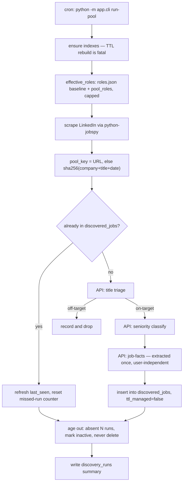

# Purpose & responsibilities

The scraper is the ingest engine for the shared job pool. Once a day it scrapes LinkedIn for a role list held in [`config/roles.json`](config/roles.json), folds the results into `discovered_jobs` under a stable `pool_key`, asks the API to triage titles and classify seniority, and has each genuinely new posting's stated requirements extracted exactly once — required years, must-have and nice-to-have tech, seniority band, domain, location. It also ages out listings that have stopped appearing, marking them inactive rather than deleting them. Alongside the cron path it runs a small FastAPI service that backs the Matches page's pool reads and the per-user save/dismiss actions.

The line it must not cross defines it: **the scraper never scores and never reads a profile.** It has no Anthropic key; every AI need is an HTTP call to the API. That is what makes one extraction result valid for everybody and keeps a shared pool affordable. It also cannot rely on `UserScopedCollection` for the calls it makes across the HTTP boundary, so identity forwarding is enforced here by a test that walks the AST.

**Non-goals:** scoring, ranking, or any judgement about fit; reading or writing a candidate profile; holding an Anthropic key; storing per-user opinions on a pool document; deleting expired listings.

## Public interfaces (contracts first)

FastAPI generates the spec at `GET /openapi.json`. Handlers: [`app/main.py`](app/main.py).

**Health**
- `GET /health`, `GET /api/discovery/health` — liveness (also used as a wake-up probe)

**Pool & jobs (what the Matches page reads)**
- `GET /api/discovery/jobs` — list pool jobs for the current user, merged with their per-user state
- `POST /api/discovery/jobs/{job_id}/save` — copy a pool job into the tracker (calls the API with `X-Source: ingest`)
- `POST /api/discovery/jobs/{job_id}/dismiss`, `POST /api/discovery/jobs/unsave` — per-user state only
- `POST /api/discovery/jobs/import` — import arbitrary pasted URLs/descriptions

**Run history** (read-only; runs are written by the daily pool ingest)
- `GET /api/discovery/runs`, `GET /api/discovery/runs/{run_id}`

The criteria CRUD, the per-criteria trigger, the per-run job drill-down and the
run abort went with the criteria-driven ingest — see `docs/scraper-slimming.md`.

**CLI** — [`app/cli.py`](app/cli.py), the cron entrypoint
- `run-pool` — **the daily shared-pool ingest**; ensures indexes, scrapes the effective role list, upserts, extracts facts for new rows, ages out absentees
- `eval-verdict`, `eval-subscore` — golden-set matching-quality harnesses

**Outbound calls into the API** — [`app/services/match_client.py`](app/services/match_client.py), [`tracker_client.py`](app/services/tracker_client.py): `POST /api/match/title-triage`, `/seniority-classify`, `/job-facts` (all user-independent, `user_id=None`), `/discovery-score-batch` (import only), plus `GET /api/applications/exists` and `POST /api/applications` (user-scoped, id required).

**Events produced/consumed:** None.

## Invariants & rules

- **Identity is forwarded explicitly or not at all.** Every API call goes through `tracker_client._request_with_retry`, whose `user_id` parameter has **no default**: pass the resolved id for user-scoped calls, an explicit `None` for genuinely user-independent ones. A call that omits it does not fail — the API mints a fresh user and files the write where nobody will find it (this shipped once: "Add" wrote invisible applications). [`tests/test_identity_forwarding.py`](tests/test_identity_forwarding.py) walks the AST and fails on any call site that omits it.
- **Offline commands never guess an identity.** The demo seeder and the eval CLIs use `identity.instance_user_id`, which raises on a Cookie-mode instance rather than inventing a user.
- **A pool document holds only what is true for everyone.** `dismissed` and `saved_to_tracker` live in `poolJobState` keyed `(userId, jobId)`; scores live in `jobScores`. Both are separate collections because the scoring path upserts whole documents and would otherwise clobber state written here.
- **`pool_key` is the identity of a listing** — the job URL, else `sha256(company + title + date)` — with a unique index behind it.
- **Expired listings are marked inactive, never deleted.** Enforced structurally: the 60-day retention TTL is a *partial* index on `ttl_managed: true`, a positive marker the criteria path sets and the pool path clears (a partial filter cannot express "field absent"). `ensure_ttl_index` is the one **fatal** initializer here — while an old unfiltered TTL is in place, every shared pool row is a deletion candidate. It creates the new index before dropping the old one, and verifies shape rather than name.
- **Roles are configuration plus growth, capped.** `effective_roles` = the file baseline (never cut) + `pool_roles` rows written by the API when a profile is saved, ordered most-needed-first then oldest, filling whatever `max_roles` leaves. An unreadable `pool_roles` degrades to the baseline rather than refusing to run.
- **Facts are extracted once, on entry.** New rows only; `_retry_missing_facts` picks up rows a previous run failed to extract.
- **Retries and pacing.** `_request_with_retry` honours `Retry-After` on 429 within a floor/ceiling; `scoring_delay_seconds` (default 2.0) paces calls; scraping runs in an executor so the event loop is not blocked.
- **Demo guard.** `demo_mode=true` blocks every mutating route via middleware in `main.py` — a new mutating endpoint must be allowlisted there to work on the demo instance.

## Where things live

| Role | Path |
|---|---|
| FastAPI app, routes, demo guard, lifespan | [`app/main.py`](app/main.py) |
| Cron entrypoint | [`app/cli.py`](app/cli.py) |
| Shared-pool ingest (scrape → upsert → extract → age out) | [`app/services/pool.py`](app/services/pool.py) |
| jobspy wrapper, cleaning, remote correction | [`app/services/scraper.py`](app/services/scraper.py) |
| Calls into the API (AI) | [`app/services/match_client.py`](app/services/match_client.py) |
| Calls into the API (tracker) + retry policy | [`app/services/tracker_client.py`](app/services/tracker_client.py) |
| Per-user pool state | [`app/services/pool_state.py`](app/services/pool_state.py) |
| Role list: file baseline + growth + cap | [`app/roles.py`](app/roles.py), [`config/roles.json`](config/roles.json) |
| Identity resolution (mirrors the API) | [`app/identity.py`](app/identity.py) |
| Index and TTL management | [`app/indexes.py`](app/indexes.py) |
| Enrichment clients (Glassdoor, news, DDG, company size) | [`app/services/*_client.py`](app/services) |
| Demo seeding, eval harnesses | [`app/services/demo_seed.py`](app/services/demo_seed.py), [`verdict_eval.py`](app/services/verdict_eval.py), [`subscore_eval.py`](app/services/subscore_eval.py) |

## Control flow (core: the daily pool ingest)



## Data & state

- **`discovered_jobs`** (shared) — one document per listing. `pool_key` unique; also indexed for the API's candidate filter. Carries scraped fields, triage outcome, seniority band, and extracted job facts. `ttl_managed: true` on criteria-driven rows only; those expire after 60 days under `ttl_discovered_at_60d_managed`. Pool rows set it `false` and age out by `missed_runs` instead, never deleted. The one remaining writer of `true` is `_backfill_ttl_managed`, which stamps only rows with no `pool_key` — the criteria-era leftovers, which therefore still expire on their own.
- **`discovery_runs`** (shared) — one row per run: counts scraped/new/refreshed/extracted/marked-inactive, status, error.
- **`poolJobState`** (per user) — `_id = "<userId>:<jobId>"`, holds `dismissed` / `saved_to_tracker`.
- **Caching / TTLs:** no application cache. The only TTL is the retention index above.
- **Migrations:** `_backfill_ttl_managed` stamps rows written before the field existed. Index management is idempotent and runs from both the service lifespan and the CLI, so a cron-only deployment still gets it.

## Configuration & flags

Plain env vars (no `__` mapping); a local `.env` is read. Unknown keys are **ignored**, not rejected, so a retired variable left set in a deploy cannot crash startup. Defaults: [`app/config.py`](app/config.py).

| Variable | Default | Purpose |
|---|---|---|
| `MONGODB_CONNECTION_STRING` | `""` (**required**) | Atlas connection string |
| `MONGODB_DATABASE_NAME` | `job-tracker` | Database holding the pool |
| `API_BASE_URL` | `http://localhost:5002` | The API — all AI and tracker calls |
| `API_KEY` | `""` | Sent as `X-Api-Key`; needed only when the target API has its own gate |
| `SCORING_DELAY_SECONDS` | `2.0` | Pacing between API calls |
| `CORS_ORIGINS` | `*` | Comma-separated browser origins; must be explicit in Cookie mode |
| `IDENTITY_MODE` | `fixed` | `fixed` or `cookie` — mirrors the API's `Identity:Mode` |
| `IDENTITY_FIXED_USER_ID` | `""` | The user in fixed mode |
| `IDENTITY_COOKIE_NAME` | `uid` | Cookie read in cookie mode (**read only** — the API issues it) |
| `ROLES_CONFIG_PATH` | `config/roles.json` | Where the role list lives |
| `DEMO_MODE` | `false` | Block every mutating route |
| `CRON_SECRET` | `""` | Reserved; retired with the RAG migration, kept so existing deploys need no change |

**Role-list config** ([`config/roles.json`](config/roles.json)): `roles`, `locations`, `site_names`, `results_wanted`, `hours_old`, `country`, `missed_runs_before_inactive`, `max_roles`. Editing the file (or pointing `ROLES_CONFIG_PATH` elsewhere) changes the next run — nothing here is derived from a profile.

## Dependencies

**Internal**
- `server/api` — every AI call plus tracker dedupe and save. *Without it a run still scrapes and upserts, but new rows get no triage, seniority, or facts* — and an unextracted row will not survive the API's candidate filter, so the pool grows without becoming matchable.

**External**
- **LinkedIn via `python-jobspy`** — *failure modes:* empty or failed searches per role, counted into `searches_failed` / `searches_empty` on the run; rate limiting and layout changes are the usual causes. *Fallback:* none; the run completes with fewer jobs.
- **MongoDB Atlas** — a failed TTL rebuild is fatal by design; other failures fail the run and are recorded on the `discovery_runs` row.
- **Glassdoor / DuckDuckGo / news** (enrichment, manual and legacy paths only) — best-effort; a failure degrades the prompt, never the run. The shared pool deliberately does **not** enrich: a Glassdoor rating is a fact about a company, not about the fit.

## Observability & failure modes

- **Logs:** `logging` to stdout, shipped by Promtail to Loki. A pool run logs its role count up front and a one-line summary at the end (`N scraped, N new, N refreshed, N extracted, N marked inactive`) — the fastest health signal there is.
- **Run records:** `discovery_runs` holds status, error text, and the search counters; a run that failed is queryable after the fact.
- **Signals worth recognising:**
  - `Role cap reached (max_roles=…)` — user-grown roles are being held back; raise `max_roles` if the pool should cover them.
  - `Could not read pool_roles; running the baseline roles only` — degraded, not broken.
  - `TtlRebuildFailed` — the process refuses to run. The pool is unprotected from retention until it is fixed; do not work around it.
  - `searches_failed` climbing across runs usually means LinkedIn-side throttling.
- **Alerts / dashboards:** none specific to the scraper beyond [`deploy/monitoring/check-services.sh`](../../deploy/monitoring/check-services.sh), which watches the `scraper` and `demo-scraper` containers.

## Performance & limits

- A real run over the five seed roles found **167 unique postings**; one-off fact extraction over all of them cost **$0.33 — about $0.002 a job** (Haiku), measured over a 72-hour window against 60-day retention.
- The per-day cost of a role is `titles × locations` extra scraping, which is why `max_roles` caps the total rather than the write path.
- Scraping runs in a thread executor; API calls are paced by `scoring_delay_seconds` and back off on `Retry-After`.

## How to change this

**Add or change a searched role**
1. Edit [`config/roles.json`](config/roles.json) — this is the human-authored baseline and is never dropped by the cap.
2. Check `max_roles` leaves room for the grown roles you still want searched.
3. Re-run `python -m app.cli run-pool` and read the summary line.

**Add a field to a pool document**
1. Ask the test first: *could two users ever disagree about this?* If yes, it belongs in `poolJobState` or `jobScores`, not here.
2. Extend [`app/models/discovered_job.py`](app/models/discovered_job.py) and set it in `pool._upsert`.
3. Add an index in [`app/indexes.py`](app/indexes.py) if the API's candidate filter will read it, and mirror the read in `server/api/src/Core/Matching/CandidateFilter.cs`.
4. Tests: [`tests/test_scraper.py`](tests/test_scraper.py) and, if a new API call appears, confirm `tests/test_identity_forwarding.py` still passes.

**Add a call into the API**
1. Add it in `match_client.py` or `tracker_client.py`, going through `_request_with_retry`.
2. Pass `user_id=` explicitly — the resolved id, or `None` with a comment saying why it is user-independent. The AST test will fail the build otherwise.

**Rollout/rollback:** a push to `main` under `server/scraper/**` triggers [`.github/workflows/scraper.yml`](../../.github/workflows/scraper.yml). The daily run is a systemd timer invoking `docker compose --profile cron run --rm ingest`.

## Testing

```bash
cd server/scraper && ./.venv/Scripts/python.exe -m pytest
```

- [`tests/test_identity_forwarding.py`](tests/test_identity_forwarding.py) — the AST walk; the one that makes the multi-user boundary real across HTTP.
- [`tests/test_scraper.py`](tests/test_scraper.py), [`test_glassdoor_client.py`](tests/test_glassdoor_client.py), [`test_verdict_eval.py`](tests/test_verdict_eval.py), [`test_packaging.py`](tests/test_packaging.py).
- Fixtures in [`tests/fixtures`](tests/fixtures).
- **Before seeding into any database, call `list_database_names()` and refuse if the target exists** — the seeder deletes and reinserts per user, and its blast radius is bounded only by which database it was pointed at.
- Running e2e locally: a uvicorn `--reload` reloader can survive a task kill and hold :8000 in *Bound* (not *Listen*) state, which a `-State Listen` port check misses. Kill the python PID directly.

## Security

- **AuthZ boundary:** none of its own. It resolves identity the way the API does (`app/identity.py`) and forwards it; it is the API that enforces scoping. Misconfiguration fails at startup in both services.
- **Validation hotspots:** scraped text is untrusted — it is passed to the API, which XML-wraps it in the user message; `_clean`/`_clean_bool` normalize jobspy's NaN-laden output; `_correct_is_remote` fixes a field the source gets wrong.
- **Secrets touched:** `MONGODB_CONNECTION_STRING`, optionally `API_KEY`. **No Anthropic key** — by design.
- **Multi-tenant:** writes to `poolJobState` and to the tracker are per user; the pool itself is shared and must stay that way.

## Related links

- [`docs/job-pool.md`](../../docs/job-pool.md) — pool identity, presence, fact extraction, role growth, measured size
- [`docs/multi-user.md`](../../docs/multi-user.md) — the hole `UserScopedCollection` does not cover, and how this service closes it
- [`docs/scoring-and-search.md`](../../docs/scoring-and-search.md) — what happens to a pool job after ingest
- [`docs/hosting.md`](../../docs/hosting.md)
- [`server/api/IMPLEMENTATION.md`](../api/IMPLEMENTATION.md) — the endpoints this service calls
- [`OVERVIEW.md`](../../OVERVIEW.md) · [`AGENTS.md`](../../AGENTS.md)
